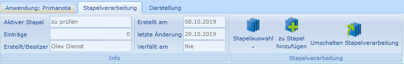
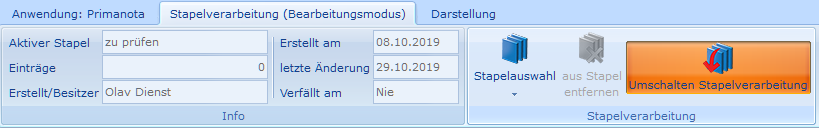

# Umschalten Stapelverarbeitung

<!-- source: https://amic.de/hilfe/umschaltenstapelverarbeitung.htm -->

Die Stapelverarbeitung hat im Prinzip zwei Modi, zwischen denen einfach mit der Funktion „Umschalten Stapelverarbeitung“ hin und her gewechselt werden kann:

1) Hinzufügen zu einem Stapel:

   

2) Bearbeiten eines Stapels:

   

Beim Umschalten in den Bearbeitungsmodus werden nur die aufgesammelten Datensätze angezeigt. Um möglichst alle ausgewählten Datensätze anzuzeigen, werden alle Häckchen in der F2-Bereichsauswahl automatisch deaktiviert. Um die letzte Eingrenzung wieder zu aktivieren muss lediglich die Bereichseingrenzung einmal aufgerufen werden. Diese wird dann mit den vorherigen Werten angezeigt.

Im Bearbeitungsmodus kann die Variante nicht gewechselt werden.

Den Bearbeitungsmodus verläßt man wieder, indem man erneut „Umschalten Stapelverarbeitung“ auswählt oder indem man Escape drückt.
