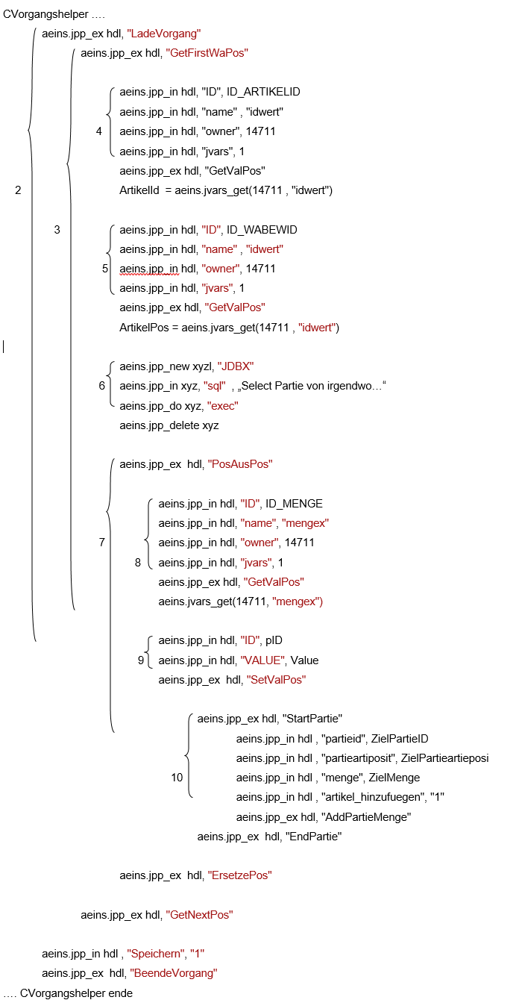

# Beispiel Positionen zusammenführen

<!-- source: https://amic.de/hilfe/beispielpositionenzusammenfhre.htm -->

Nur wenn alle einzelnen Schritte ohne Fehler verlaufen sind wird der Vorgang verändert.

Auch hier ist die Schachtelungstiefe sehr gut zu erkennen

1. JPP-Objekt erzeugen, füllen, beenden (siehe Beispiel vorher)

2. Vorgang laden, speichern und beenden

3. alle Warenpositionen des Vorgangs durchlaufen

4. Die ArtikelID der aktuellen Warenposition holen (wird intern zum Vergleichen benötigt)

5. Die WABEWID der aktuellen Warenposition holen (s.o.)

6. Mittels SQL-Staement prüfen ob Partie in der Position vorhanden ist

7. Warenposition laden, bearbeiten, speichern

8. Menge der aktuellen Warenposition holen

9. Neue Menge der Warenposition setzen

10. Partie um die neue Menge erhöhen

Die gesamte Programmlogik wurde hier weggelassen da sie sehr umfangreich ist und die Bestandeile der JPP-Objekte somit nicht mehr klar erkennbar wären.

Es werden alle Warenpositionen (kurz WaPo) des Vorgangs durchlaufen. Zu jeder WaPo wird geprüft ob sich der Artikel und die Partie, die verändert werden sollen, in der gerade aktuellen WaPo befinden. Trifft das zu wird die Menge der Warenposition ausgelesen, erhöht und entsprechend mit der Partiemenge verfahren.
