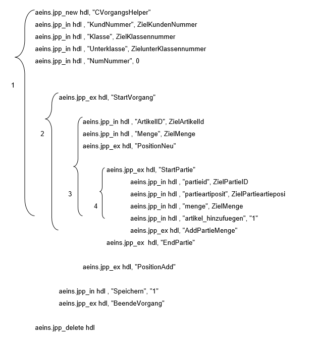

# Beispiel Vorgang neu anlegen

<!-- source: https://amic.de/hilfe/beispielvorgangneuanlegen.htm -->

ZielKundenNummer, ZielKlassennummer etc. sind Variablen die die zu speicherden Werte enthalten.

An diesem Beispiel kann man sehr schön die Schachtelungstiefe erkennen

1. JPP-Objekt erzeugen, füllen, beenden

2. Vorgang starten, speichern und beenden

3. neue Warenposition hinzufügen

4. neue Partie hinzufügen

Nur wenn alle einzelnen Schritte ohne Fehler verlaufen sind wird ein neuer Vorgang erzeugt.
