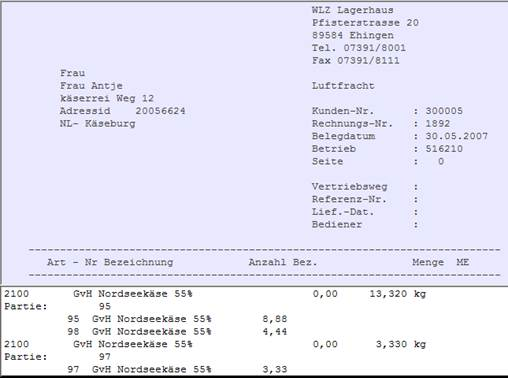

# Fehlermeldungen und Hinweise

<!-- source: https://amic.de/hilfe/fehlermeldungenundhinweise.htm -->

Tritt ein Fehler auf so wird das Script beendet und eine Fehlermeldung in die Fehlerprotokolltabelle geschrieben. In den Fehlermeldungen werden zur schnellen Identifizierung der Fehlerursache das aufrufende Script, die Funktion, evtl. eine Textposition und ein Hinweis auf den Fehler angegeben.

Hat der Automatismus einwandfrei funktioniert so werden diverse Hinweise in die Fehlerprotokolldatei geschrieben. In den Hinweisen werden die unterschiedlichen Vorgänge sowie die wichtigsten Attribute wie Kundennummer, Artikelnummer, Partienummer etc. angegeben.

Steht im Fehlerprotokoll - Bereich *„Auftrag automatisch erzeugen“* so wurde die Meldung vom Script bestellung_start.vbs generiert. Steht dort *„Bestellung automatisch erzeugen“* so kommt der Hinweis vom Script „bestellung.vbs“

In der ersten Zeile steht jeweils ein Hinweis was dort aufgetreten ist, ein *„Fehler!“* oder ein *„Hinweis!“*

Ist ein Script automatisch und ohne Fehler abgelaufen so stehen zurzeit 6 Hinweise im Fehlerprotokoll

Jeweils 2 Meldungen gehören zu einem Vorgang,

der Auftrag steht unter „Auftrag automatisch erzeugen“ (aus bestellung_start.vbs)

wenn der Auftrag erfolgreich bearbeitet wurde wird ein Eintrag unter „bestellung automatisch erzeugen“ (aus Bestellung.vbs) erzeugt

Steht zu Beginn der sechs zum Automatismus gehörenden Spalten unter „was“ nur „Hinweis ! ..:“ (und nicht Fehler !) ist die automatische Vorgangserstellung korrekt abgelaufen.

Nun kann zur Endkontrolle anhand der Hinweise im Fehlerprotokoll im Aeins-System kontrolliert werden ob alle Vorgänge auch korrekt abgearbeitet wurden, die Partien und Mengen stimmen.

Die Fehler- und Hinweismeldungen können über die Schalter 

MSG_ERROR_ON

MSG_HINWEIS_ON

abgeschaltet werden. Dieses ist zurzeit nur im Script möglich.

Eine Möglichkeit diese über Parameter oder über einen Konfigurationsabschnitt in der XML-Datei zu steuern ist angedacht.
