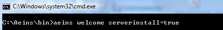

# Starten der automatischen Vorgangserzeugung

<!-- source: https://amic.de/hilfe/startenderautomatischenvorgang.htm -->

Zum Starten der automatisierten Vorgangserzeugung ist der einfache Aufruf des VB-Skripts bestellung_start.vbs mittels doppelklick oder per Kommandozeile notwendig. Parameter sind nicht erforderlich.

Für die Zeitdauer des Skriptlaufes (kann je nach Rechner etwas dauern) ist das A.eins Icon in der Taskleiste sichtbar.

 

Falls dieses Icon nicht mehr verschwindet ist ein unerwarteter Fehler aufgetreten!

Im Normalfall ist das Icon nach kurzer Zeit verschwunden und die automatische Vorgangserzeugung erfolgreich beendet.

Voraussetzung der Vorgangserzeugung per VB-Skript ist die Registrierung des A.eins COM-Objekt auf dem Client.

