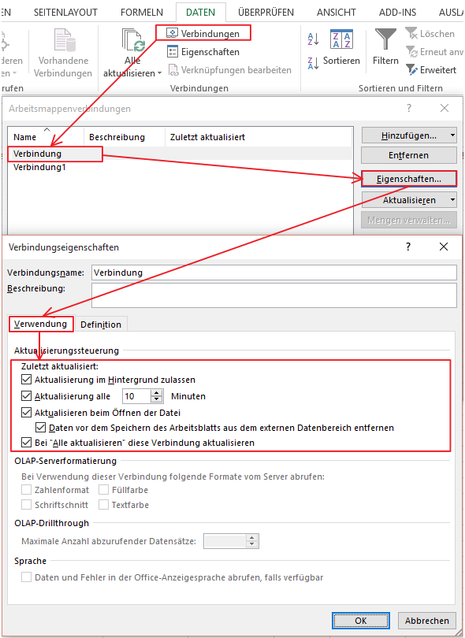

# Aufbau eines automatischen DATA-Refresh Systems

<!-- source: https://amic.de/hilfe/aufbaueinesautomatischendatare.htm -->

Es ist sehr angenehm, wenn beim Öffnen einer BI Anwendung diese auch sofort die Daten aktualisiert. Per Standard wird dieses nicht eingestellt. Innerhalb des Verbindungsmanagers der Excel Anwendung kann nun aber eine Einrichtung vorgenommen werden, die eine automatische Aktualisierung erlaubt.

Es sind hier die Felder

- Aktualisierung im Hintergrund zulassen
- Aktualisierung alle … Minuten
- Aktualisierung beim Öffnen der Datei
- Daten vor dem Speichern entfernen
- Bei „Alle Aktualisieren“ mit berücksichtigen

zu pflegen:

Im Anschluss an die Änderung dieser Werte ist die Excel Datei auf jeden Fall wieder in die Datenbank [zurückzuspeichern](./rueckspeicherung_von_excel_mappen_mit_geaenderten_einrichtun.md).
