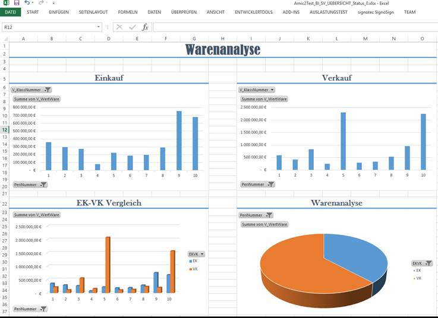

# Beispielanwendung Einkauf Verkauf

<!-- source: https://amic.de/hilfe/beispielanwendungeinkaufverkau.htm -->

Folgende Bespielanwendung stellt den Einkauf periodenweise dem Verkauf gegenüber:

Grundlage dieser Auswertung ist die Auswahlliste Vorgangsübersicht, Variante 1. Diese Variante wird einmal in ein Tabellenblatt „SV_UBERSICHT_Status“ als Komplettdatenbereich geladen, des Weiteren wird die BI View noch mit der Eingrenzung für den Verkauf und der Eingrenzung für den Einkauf in die Tabellenblätter Einkauf und Verkauf geladen. Als Auswertung darauf sind 4 Pivot-Auswertungen gestaltet worden, die zusätzlich noch mit eine Pivot-Graphik verbunden worden sind.
