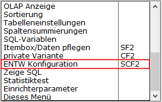
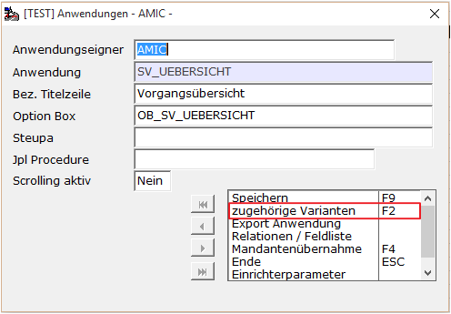
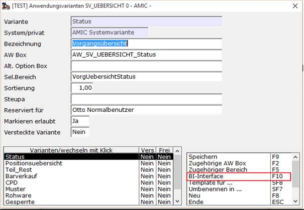

# Erstellen eine BI Interfaces

<!-- source: https://amic.de/hilfe/erstelleneinebiinterfaces.htm -->

Um auf Basis eine Standardvariante oder einer privaten Ableitung einer Variante ein BI Interface zu erstellen muss diese Variante in der Funktion „ENTW Konfiguration“ angesteuert werden:

Die Funktion BI-Interface startet dann einen Bildschirm, der zwei Hauptfunktionen enthält:

Erzeugung oder Update eines BI Interfaces.

Hinzufügen eines abgeänderten Excel Blattes in dieses BI Interface.

In dem oberen Bereich wird angezeigt, auf welcher Datenbankverbindung dieses BI arbeitet, darunter befinden sich die Identifikationen der Anwendung und der Variante sowie die Kennzeichnung zur Standard=0 oder Privat=1 Ableitung.

Der mit dem Zahnrad versehene Knopf erstellt nun zu dieser Variante ein Interface.

Die drei Felder Anwendung Variante und Besitzer können auch auf dieser Maske angepasst werden, % Platzhalter in den ID Felder sind erlaubt, d.h. wird in der Anwendung und in der Variante ein % angegeben so wird für alle 4500 Anwendungsvarianten ein BI Interface mit passendem Menüpunkt erzeugt.

Während der Erstellphase können mehrere Fehlerbedingungen auftreten, die wie [hier](./inkompatibilitaetsprobleme.md) beschrieben behoben werden müssen.

Zum Schluss wird noch automatisch ein Excel Template erstellt und in die Datenbank verbracht, so dass sofort mit der Arbeit an dieser Auswertung begonnen werden kann. Hierzu muss einfach nur das Programm verlassen und wieder neu gestartet werden, um im Informationsbereich den neuen Menüpunkt zu sehen.
