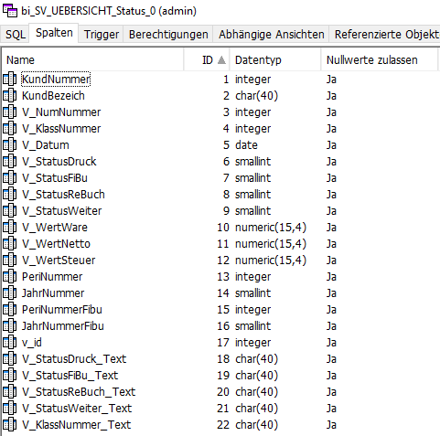
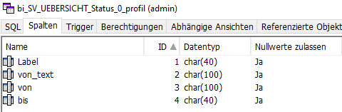
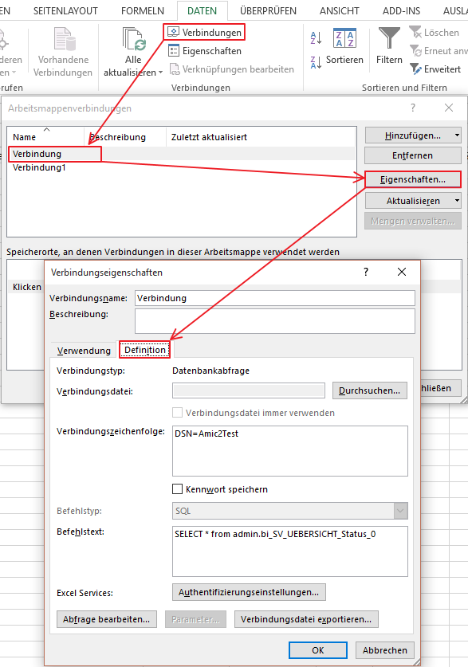

# Excel Einrichtung Verbindungen

<!-- source: https://amic.de/hilfe/exceleinrichtungverbindungen.htm -->

Ein über die BI Schnittstelle arbeitende Excel-Mappe bedient sich per Datenquery an Daten aus dem A.eins System. Hierbei wird für jede Variante der Auswahlliste eine View bereitgestellt, die mit BI_ beginnt und dann zunächst die ID der Anwendung gefolgt von der ID der Variante als Namen trägt und zum Abschluss eine 0 für Standard Variante und 1 für private Variante. Als Beispiel sei hier die Auswahlliste „Vorgangsübersicht“ mit der Variante Vorgangsübersicht.

Intern trägt die Anwendung Vorgangsübersicht den Namen SV_UEBERSICHT und die erste Variante den Namen Status, somit lautet der Name der passenden BI View : BI_Uebersicht_Status_0. Zusätzlich dazu existiert dann immer eine passende View zum angewälten Profil mit der Endung _Profil:

Die Felder des BI Interfaces entsprechen den Felder der Auswahlliste, und zwar des SQL Statements bereinigt um alle doppelten Felder. Zusätzlich werden alle Felder, die mit einen Formatstring verbunden sind (siehe auch FIELD) als textliche Representation mit angegeben, hierbei wird die Endung _Text an das .Feld angehängt.

Im Excel wird dann einfach nur die Query auf diese View gelegt (in Excel zu errreichen über den Abschnitt DATEN -> Verbindungen):

