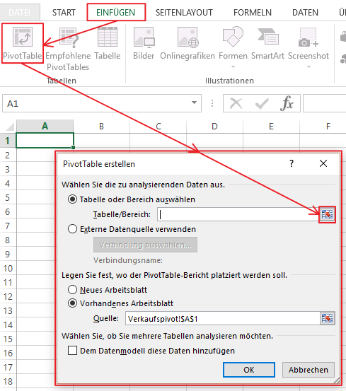
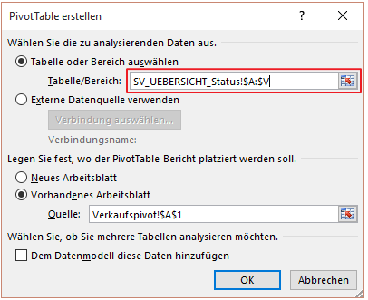

# Pivot Tabellen erstellen

<!-- source: https://amic.de/hilfe/pivottabellenerstellen.htm -->

Eine einfache Pivot-Tabelle lasst sich nun bequem auf dem Template der BI Anwendung erstellen, dazu wird zunächst ein neues Tabellenblatt geöffnet, und der Name des Blattes wird an den Inhalt angepasst, wie z.B.: Verkaufspivot.

Jetzt wird einfach auf den kleinen roten Pfeil im Bereichsauswahlknopf gedrückt, um dann das Blatt Verkauf anzusteuern:

um hier dann ALLE Spalten des Datenbereiches auszuwählen. Es ist wichtig, dass hier $A:$V und nicht $A1:$V45987 steht, da bei nicht spaltenorientierten Bereichseingrenzungen dann leider bei mehr als z.B. 45987 Datensätzen Fehlberechnungen entstehen.

Durch auslösen der RETURN Taste und dem Bestätigen des OK Felder in der Pivotbereichsmaske kann nun bequem die Pivoauswertung zusammengestellt werden.

Wichtig hierbei ist wieder, dass nach Abschluss der Designarbeiten die Excel Datei in der Datenbank abgelagert wird. Ein weiterer Hinweis bezieht sich auf den [automatischen Refresh](./automatisches_refresh_beim_pivotelement/index.md) teil der Excel Pivot Anwendung, die Daten werden nicht in jedem Falle neu aus dem Datenbereich gelesen, hierzu muss dem Excel System mitgeteilt werden, dass nach erfolgreichem Lesen der Daten aus der Datenbank die Pivotabelle (oder Tabellen) automatisch neu berechnet werden sollen, hierzu ist der entsprechende [Absatz](./automatisches_refresh_beim_pivotelement/index.md) zu lesen.
