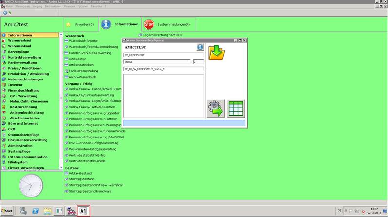
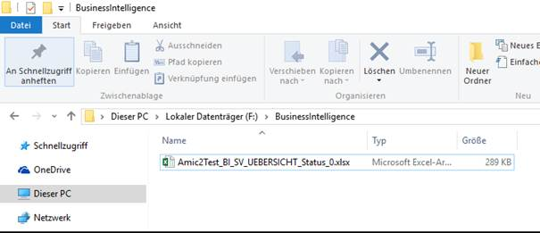
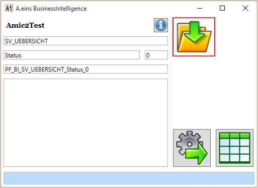

# Rückspeicherung von Excel Mappen mit geänderten Einrichtungen

<!-- source: https://amic.de/hilfe/rckspeicherungvonexcelmappenmi.htm -->

Eine abgeänderte Excel-Datei sollte in jedem Falle aus dem „TEMP“ Bereich in den Dokument Ordner des Anwenders zu speichern, um ungewünschte Lösch- sowie Überschreibeffekte zu verhindern.

Um nun die Änderungen permanent auch in der Datenbank abgelegt vorzuhalten, ist die BI Anwendung nicht per einfachem Mausklick anzuwählen, sondern die SHIFT Taste muss festgehalten werden, um dann per Maus auf die BI Anwendung im Menü zu klicken.

Beispiel:

Bei gedrückt gehaltener SHIFT Taste ist die Anwendung Vorgangsübersicht (BI) angeklickt worden:

Es erscheint in der Taskleiste dann ein A1 Sysmbol. Als nächstes muss nun per Explorer im Windows die Excelmappe angesteuert werden, die zu dieser Anwendung passt:

Und per Drag and Drop auf der Anwendung A1 im Orderfeld abgeladen werden. Es geht kurz die Excelmappe auf, wird überprüft um dann in der Datenbank abgelegt. Vor nun an steht die Änderung den Anwendern zur Verfügung.

