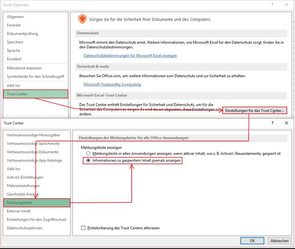
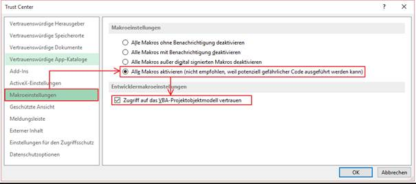
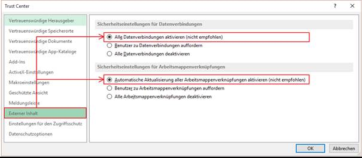

# Sicherheitsrelevante Einstellungen im EXCEL Umfeld

<!-- source: https://amic.de/hilfe/sicherheitsrelevanteeinstellun.htm -->

Standardmäßig wird Excel System ein Zugriff auf externe datenquellen unterbunden. Um bequem und ohne Zwischenfragen auf die Datenquellen zugreifen zu können, sollten folgende sicherheitstechnische Einstellungen verändert werden:

Es kann natürlich eine digitale Signatur der eingebetteten Makros vorgenommen werden, ist aber nur mit viel Aufwand machbar. Sinvoller erscheint die Frage, ob der Anwender ein Verbot auf „Download Makros“ bekommt, um dem Risiko der Virus Infizierung zu begegnen.
