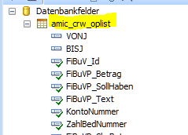
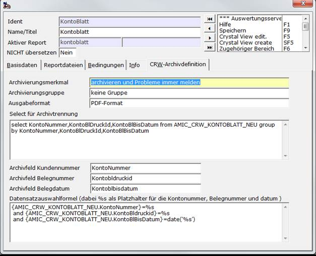
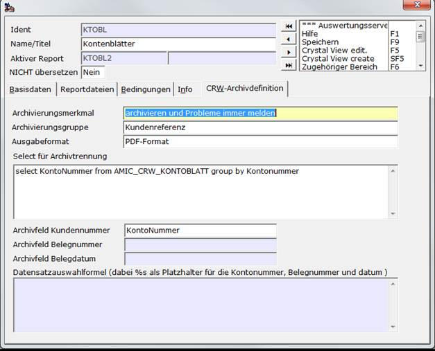

# CRW-Archivdefinition

<!-- source: https://amic.de/hilfe/crwarchivdefinition.htm -->

Hauptmenü > Administration > Werkzeuge > Anwendung Reports > Register CRW-Archivdefinition

Direktsprung **[ANWR]**.

Wird ein Report gedruckt, so ist es möglich diesen auch zu archivieren. Wenn der Report nicht über [JPP](../crystal_report_ueber_jpp_aufrufen.md#CrystalReportUeberJPP) aufgerufen wird und dort die Werte für Kundnummer, Belegnummer, Belegdatum und Belegreferenz nicht übergeben werden, können auf diesem Register dafür diverse Einstellungen vorgenommen werden.

| Feld | Bedeutung |
| --- | --- |
| Archivierungsmerkmal | Wie soll archiviert werden. Es lassen sich hier mit F3 folgende Einstellungen auswählen: <ul><li>nicht archivieren</li><li>archivieren und Probleme immer melden</li><li>archivieren und Probleme nur einmal melden</li><li>archivieren und Nachricht im Fehler-/Ereignisprotokoll &nbsp;</li></ul> |
| Archiv Belegklasse | Für Report ist die Belegklasse bisher immer nur CRW-Report(6000) gewesen. Jetzt kann hier bei privaten Reporten eine Belegklasse hinterlegt werden.  |
| Archivierungsgruppe | Hier steht ein Anwenderformat zur Verfügung. Folgende Werte sind von AMIC vorgegeben: <ul><li>keine Gruppe</li><li>Streckengeschäft</li><li>Führender Beleg   Weitere Gruppen können individuell erfasst werden.   </li></ul> |
| Ausgabeformat | Im Normalfall werden die Reporte im PDF-Format archiviert. Es ist jedoch auch möglich, den Report im Word-Format zu archivieren   |

Je nach Einstellung der Gruppe werden unterschiedliche Verweise auf Kunden im Archiv hinterlegt:  
    

#### Keine Gruppe

Wird in den Feldern nichts angegeben wird der Report ohne einen Bezug zu einem Kunden bzw. Datum im Archiv gespeichert. Will man die Zuordnung zu Kontonummer, Belegnummer und Belegdatum im Archiv herstellen, so müssen die folgenden Felder belegt werden.  

Um einen Report zu archivieren, der eigentlich die Daten mehrerer Konten enthält, muss er für das Archiv getrennt werden. Intern wird der Report dann noch einmal, jedoch diesmal pro angesprochenem Konto bzw. Beleg erzeugt. Das Feld „Select für Archivtrennung“ ist dann für die äußere Schleife zuständig.

| Feld | Bedeutung |
| --- | --- |
| Select für Archivtrennung | SQL-Statement, für die Schleife.  |
| Archivfeld Kundennummer | Feldname aus dem SQL-Statement, der den Wert für die Kundennummer im Archiv liefert.  |
| Archivfeld Belegnummer | Feldname aus dem SQL-Statement, der den Wert für die Belegnummer im Archiv liefert.  |
| Archivfeld Belegdatum | Feldname aus dem SQL-Statement, der den Wert für das Belegdatum im Archiv liefert.  |
| Datensatzauswahlformel (Crystal-Report ) | Es muss jetzt noch dem Report mitgeteilt werden, dass er nur einen Teil darstellen soll. Dazu muss hier die Eingrenzung eingegeben werden. Der Syntax ist dabei so, wie sie im Formeleditor von Crystal Report stehen. Dabei werden die Felder wie folgt in geschweiften Klammern angegeben:   <code>{HandelWieImCRWEditor.NameDesFeldes}</code>     Beispiel für die Fibuv_id: <code>{amic_crw_oplist.FiBuV_Id}</code>   Die Werte der Felder werden über Platzhalter (%s) in der Reihenfolge Kundennummer, Belegnummer, Belegdatum an die Formel übergeben.  |

Beispiel:

Hier soll ein Kontoblatt archiviert werden. Neben der Kontonummer sind die KontBlDruckid und das Bisdatum die Kriterien, nach denen das Kontoblatt getrennt werden soll. In diesem Kontoblatt werden die Daten über ein Crystal-View bereitgestellt und enthalten bereits die Eingrenzung, die über den Auswahlbereich eingegeben wurde. Die Daten müssen gruppiert ( group by ) werden, sonst würde man pro Zeile im Kontoblatt einen Archiveintrag erhalten.

In den Archivfeldern müssen die Felder aus dem SQL-Statement stehen.

Bei der Datensatzauswahlformel ist zu beachten, dass bei numerischen Werten keine Hochkomma stehen dürfen, bei Felder vom Typ char müssen Hochkomma stehen und Datumsfelder müssen über die Funktion date() typgerecht bereitgestellt werden. Dieses Statement sollte im Crystal Report getestet werden, da bei einem Fehler der Report nicht archiviert wird!

#### Gruppe laut Einstellung

Wenn eine Gruppe eingetragen wird, so werden die Felder „Archivfeld Belegnummer“, „Archivfeld Belegdatum“ und „Datensatzauswahlformel“ deaktiviert. Bei der Archivierung wird der Report als Ganzes gespeichert, jedoch werden Verweise eingetragen, über die man dann die Archiveinträge zu einem Kunden, einer Partie oder …. wiederfinden kann. Das „Select für die Archivtrennung“ muss dann alle Daten für diese Zuordnung liefern. Das „Archivfeld Kontonummer“ ist der Feldname aus dem SQL-Statement, der den Wert für die Zuordnung im Archiv liefert.

Beispiel:

Hier sollen die Kontoblätter als Ganzes archiviert werden. Für die Kontonummer soll ein Verweis gebildet werden. In diesem Kontoblatt werden die Daten über ein Crystal-View bereitgestellt und enthalten bereits die Eingrenzung, die über den Auswahlbereich eingegeben wurde. Die Daten müssen gruppiert ( group by ) werden, sonst würde man pro Zeile im Kontoblatt einen Archiveintrag erhalten.

Im Archivfeld steht der Name des Feldes aus dem SQL-Statement.
