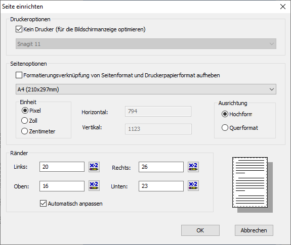

# Einrichtung des Reports

<!-- source: https://amic.de/hilfe/einrichtungdesreports.htm -->

Im Editor des Crystal-Reports muss die Seite wie folgt eingerichtet sein:

Unter dem Menüpunkt „Datei“ existiert der Punkt „Seite einrichten…“. Im nun geöffneten Dialog müssen die Häkchen wie im Bild gesetzt werden.

