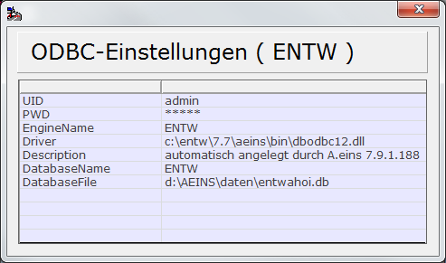

# Problembehandlung

<!-- source: https://amic.de/hilfe/problembehandlung.htm -->

Leider kann es vorkommen, dass bei der Ausführung von Crystal Report Probleme auftreten. Je nach Schwere des Fehlers muss entschieden werden, was zu unternehmen ist. Hier folgen einige Tipps, wo man nachsehen kann, was nicht stimmt.

1. Nachsehen in der Systeminformation. Direktsprung **[SYSIN]**

   In der Systeminformation im Register Umgebung wird im Feld **Version Crystal Report** die Version des installierten Reports angezeigt.  
    
Wenn die Version, die auf dem Rechner gefunden wurde, nicht der erwarteten Version entspricht, so wird das Feld rot eingefärbt und im Tiptext steht die erwartete Version.  
Ist dies der Fall, so muss herausgefunden werden, welches Programm diese Crystal-Version installiert hat. Es muss dann deinstalliert werden. Anschliessend muss lediglich die Crystal Engine vom Aeins-Setup neu installiert werden. Dazu kann man einfach im benutzerdefinierten Setup alle Punkte bis auf Crystal Report abwählen, damit nur dieser Schritt wiederholt wird.  
Danach kann das Programm, welches vorher deinstalliert wurde, wieder installiert werden.  
    
Der Button „**Version Crystal Report**“ öffnet eine Maske und zeigt die Informationen an, die für die ODBC Verbindung benötigt werden. Diese werden automatisch von A.eins erstellt. Die in Klammern stehende Bezeichnung ist die von A.eins verwendete Benutzer-DSN.  

   Der ODBC-Treiber muss auf dem BIN-Verzeichnis von A.eins existieren.  
    

2. ODBC-Verbindung überprüfen.

   Man ruft den ODBC-Datenquellen Administrator auf. Dort findet man auf dem Register „Benutzer-DSN“ den Name der verwendeten Datenquelle – es ist der in Klammern stehende Name in der Überschrift bei den ODBC-Einstellungen (s.o.). Diesen wählt man aus und klickt dann auf konfigurieren. Dort findet man einen Knopf „Verbindung testen“. Sollte der Test schiefgehen, kann man hier auch gleich die Einstellungen überprüfen bzw. ändern.

3. Ein Report, der im Dialogmodus funktioniert, erscheint nicht, wenn A.eins als Dienst läuft.

   Hier muss zuerst das Fehlerprotokoll überprüft werden. Die Meldung „Fehler beim Öffnen der Verbindung“ deutet darauf hin, dass für den Account, auf dem der Dienst läuft, keine DSN eingerichtet ist. Läßt man den Dienst auf dem Systemaccount laufen, dann muss die DSN als System-DSN eingerichtet werden.

   Hier ist gleichzeitig zu beachten, dass alle Einstellungen und Konfigurationen unter dem aktuell angemeldeten User gespeichert werden. Man kann sich aber nicht als „System Account“ anmelden, um die Konfiguration vorzunehmen. Man sollte also einen eigenen Account anlegen, auf dem man sich anmeldet, die Konfigurationen vornimmt und den Dienst dann auf diesem Account starten.  
    

4. Schreiben einer Protokolldatei.

   Wenn Crystal irgendwo abstürzt, ist es für den Support hilfreich, zu sehen, bei welcher internen Funktion das System abgebrochen hat. Dazu kann man beim Programmstart einen Parameter „**CRWPROTOKOLL=TRUE**“ angeben. Es wird dann beim Start des Reports im BIN-Verzeichnis eine Datei erstellt, die an die Entwicklungsabteilung gesendet werden kann. Der Dateiname lautet „CRW_PROTOKOLL_(Name des Reports).TXT“.
