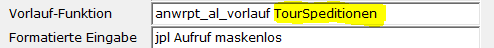

# Spezielle Vorlauf-Funktion

<!-- source: https://amic.de/hilfe/speziellevorlauffunktion.htm -->

Es gibt von AMIC eine mitausgelieferte Vorlauffunktion. Diese sucht die Daten aus der zugrundeliegenden Auswahlliste zusammen und schreibt die Werte der Felder die hinter dem Schlüsselwort IDENT angegeben worden sind, in die Tabelle Crystaldaten. Dabei wird ID1 In crw_datestring1, ID2 in crw_datstring2, usw. geschrieben. Es gibt bis zu vier IDENT-Felder. Der Name der Funktion lautet:

```text
Anwrpt_al_vorlauf
```

Sie hat einen String-Parameter, über den die Daten identifiziert werden können. Dieser kann beliebig vergeben werden. Man trägt also z.B. folgendes in das Feld Vorlauf-Funktion ein:



Dabei ist hier TourSpeditionen der Parameter. In der View selber muss man dann die Tabelle Crystaldaten mit den anderen Tabellen joinen:

```sql
Create view p_TourSpedition as select
 …
  From VorgStamm vs
  join Crystaldaten cr
    on vs.V_ID = cast(cr.CRW_DatString1 as int)
   and cr.loginid=:LDB_LOGINID
   and crw_datanwendung='TourSpeditionen')
```

Da Crystaldaten eine Tabelle ist, die von verschiedenen Programmteilen verwendet wird, muss sichergestellt werden, dass man die Daten eindeutig zuweisen kann. Dazu dient das Feld crw_datanwendung, welches den String-Parameter enthält, und die loginid.
