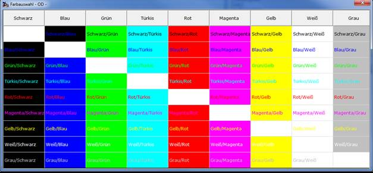

# Farbe über den Gestaltungsdialog

<!-- source: https://amic.de/hilfe/farbeberdengestaltungsdialog.htm -->

Um zum Beispiel zu vermeiden, dass man jedes Mal eine private Variante erstellen muss, nur um eine Spalte einzufärben, existiert die Möglichkeit über den Gestaltungsdialog pro Spalte die Farbe festzulegen. Den Gestaltungsdialog erreicht man, indem man in der Tabelle in die Überschriftzeile klickt oder die Funktion „Farbeinstellung“ im Menü der Auswahlliste aufruft. Der Farbdialog kann für bestimmte Benutzergruppe weggeschützt bzw. freigegeben werden, indem man der Funktion „Farbeinstellung“ im Menü der Auswahlliste bestimmte Benutzergruppen zuordnet. Die hier getroffene Einstellung überschreibt die Einstellung im SQL-Text. Diese Einstellungen werde Systemweit gespeichert, d.h. sie ist nicht Benutzer bzw. Benutzergruppenabhängig. Wenn im Bedienerstamm der Schalter „Auswahllistenadministrator“ auf „Temporär“ steht, kann man für die aktive A.eins-Sitzung die Einstellungen vornehmen, die jedoch nicht gespeichert werden.

Wenn zu einer Variante ein Feld hinzugefügt oder gelöscht wird, wird die hier gespeicherte Farbgebung gelöscht.

Mit Hilfe des Buttons „Original wiederherstellen“ werden alle Einstellungen für diese Variante gelöscht, so dass das Erscheinungsbild wieder der Vorgabe von AMIC entspricht.  
    

Die Spalten im Farbdialog haben folgende Bedeutung:

| | **Bedeutung** |
| --- | --- |
| Spaltenname | Der Name der Spalte, zu der man die Farbwerte setzen will.  |
| Farbe | Welche Farbe soll das Feld haben. Ist dort „-/-„ zu sehen, so ist keine Spezielle Farbe ausgewählt worden und es wird die unter Windows eingestellte Farbe verwendet. Beim Anklicken dieser Spalte öffnet sich eine weitere Dialogmaske, in der man die Farbe auswählen kann:  Durch klicken auf die Zelle mit der gewünschten Farbe schließt sich dieser Dialog und die Farbe wird übernommen. Will man eine einmal eingerichtete Farbe wieder zurücksetzen, wählt man „Schwarz/Weiß“.  |
| Fett/Kursiv | Durch Anklicken dieses Feldes ändert sich die Anzeige direkt auf „Fett“, dann auf „Kursiv“, dann auf „Fett / Kursiv“ und schließlich wieder auf „—„  |
| F1 bis F9 | Dies sind die Farbwerte, die angezeigt werden, wenn das Datenbankfeld/die Datenbankfunktion, die unter Funktion eingetragen ist, den Wert 1 bis 9 zurückliefert. Durch Anklicken erscheint der Farbauswahldialog (s.o.).  |
| Bedingung | Hier muss ein Datenbankfeld oder eine Funktion eingetragen sein, die einen Wert zwischen 0 und 9 zurückliefert. 0 bedeutet, es wird die Standardfarbe angezeigt. Ein Wert zwischen 1 und 9 bewirkt, dass die Zelle in der Farbe angezeigt wird, die unter F1 bis F9 steht. In der Bedingung können stehen: 1. Ein Feld aus dem Datencursor, das bereits im SQL-Text definiert ist. 2. Eine Datenbankfunktion, die einen Wert zwischen 0 und 9 zurückliefert. 3. Eine Bedingung in der Form: <code>if Saldo &lt; Kreditlimit then 1 else 0 endif</code>  |
