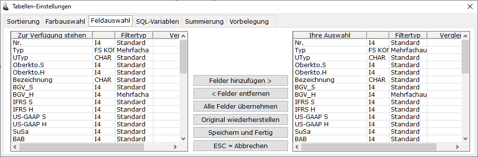
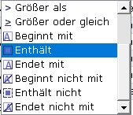
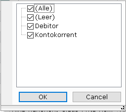

# Feldauswahl der Auswahlliste

<!-- source: https://amic.de/hilfe/feldauswahlderauswahlliste.htm -->

In den Auswahllisten wird von AMIC eine bestimmte Feldauswahl vorgegeben, die nicht immer für jeden Anwender passend sein muss. Im Gestaltungsdialog hat man die Möglichkeit nicht benötigte Spalten auszublenden bzw. aus den zur Verfügung stehenden Spalten diejenigen auszuwählen, die sinnvoll sind.



Auf dem Register **Feldauswahl** findet man links alle zur Verfügung stehenden Felder mit den Feldtypen, die von AMIC vorgegeben wurden und den Filtertypen (nur Auswahlliste 2.0). Rechts findet man die Felder, die dann in der Auswahlliste tatsächlich erscheinen mit den ggf. vom Anwender geänderten Feld- und Filtertypen.

Im SQL-Text kann man Spalten bereits im Vorwege ausblenden. Dazu dient das Schlüsselwort HIDDEN.

```text
FIELD Text,fibuvp_text,char,20,HIDDEN
```

Dieses Feld erscheint dann nur in der linken Anzeige des Registers **Feldauswahl** und kann dann vom Anwender eingeblendet werden.

Für die Feldtypen steht eine F3-Auswahl zur Verfügung. Um geänderten Feldtypen wieder auf die von AMIC vorgegebenen Originalfeldtypen zu setzen, kann man die Funktion „Original wiederherstellen“ ausführen.

Es stehen zwei verscheiden Filtertypen zur Verfügung:

- ***Standard***: Hier kann man entweder im Filter frei einen Wert eingeben oder einen Wert aus den angebotenen Daten auswählen. Zusätzlich besteht die Möglichkeit den Vergleichsoperanden auszählen:  


- ***Mehrfachauswahl***: Hier kann die Werte frei eingegeben oder aus einer Auswahl aller Werte, die in den Daten vorkommen, mehrere Werte auswählen. Es besteht jedoch keine Möglichkeit den Vergleichsoperator auszuwählen.  
  
    

Im SQL-Text kann man Spalten bereits im Vorwege so einstellen, dass der Filtertyp ***Mehrfachauswahl*** verwendet wird. Dazu dient das Schlüsselwort EXTENDEDFILTER.

```text
FIELD Mahndatum,Mahndatum,d4,20,EXTENDEDFILTER
```

***Alle Spalten mit einem FS-Format haben automatisch immer den Filtertypen Mehrfachauswahl.***

In der Spalte Vergleich kann festgelegt werden, mit welchem Operator in der Filterzeile gesucht wird. Standardmäßig ist diese Spalte leer. Es wird dann entweder der eingetragene Wert aus dem SQL-Text genommen oder der Standard, d.h. es wird bei Zahlen mit „gleich“ gesucht und bei Texten mit „enthält“. Andere Operatoren können mit F3 ausgewählt werden. Bei Feldern, für die ***Mehrfachauswahl*** ausgewählt wurde, wird der Operator nicht ausgewertet.
