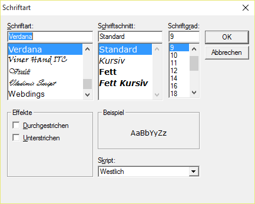

# Schriftart auswählen (nur Auswahlliste 2.0)

<!-- source: https://amic.de/hilfe/schriftartauswhlennurauswahlli.htm -->

Die Funktion Schriftart auswählen steht mit der Auswahlliste 2.0 zur Verfügung. Wird diese Funktion ausgewählt, so öffnet sich ein Dialogfenster, in dem eine Schriftart sowie Schriftschnitt und Schriftgrad auswählen kann.

Die hier ausgewält Schriftart wird pro Anwender gespeichert. Sie bezieht sich auf den gersammten anzeigebereich des Datengrids. Die Menüs werden nach wie vor in der Standardgröße von A.eins angezeigt.
