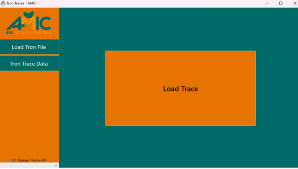
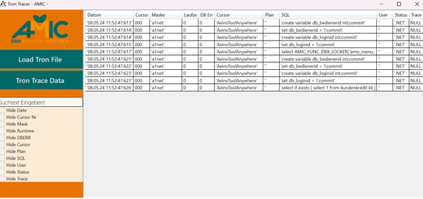
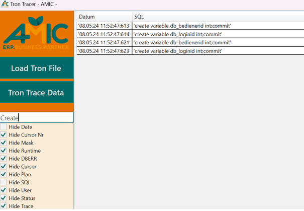

# Bedienung

<!-- source: https://amic.de/hilfe/bedienung1.htm -->

| Befehl | Resultat |
| --- | --- |
| F1 | Öffnet das Hilfefenster |
| Strg-C (1..n ausgewählte Zeilen) | Kopiert den SQL-Text aller ausgewählten Zeilen ins Clipboard |
| Linksklick in ein SQL-Text Feld | Öffnet den SQL-Text im Text Editor des Systems |

Zum Einlesen kann die Trace-Datei per Drag and Drop, oder per Klick auf den Button „Load Trace“ geladen werden.

Die Datei wird daraufhin ausgelesen und auf einer Tabelle abgebildet.

Die Tabelle kann über die Checkboxen gefiltert werden. Außerdem kann man das SQL-Feld über die Textsuche filtern (case insensitive).

