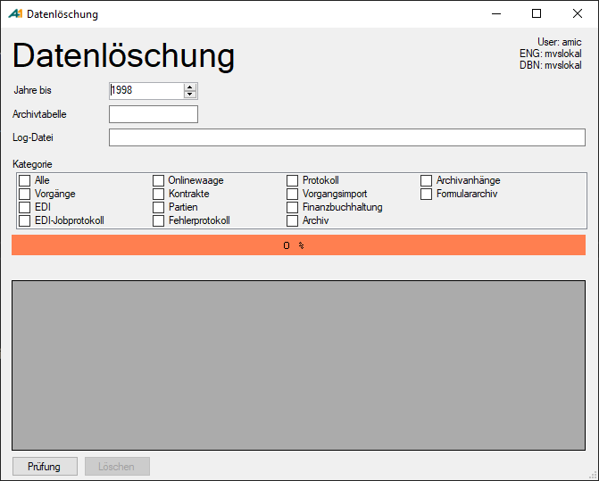

# Manuelle Löschung

<!-- source: https://amic.de/hilfe/_datloemanuloesch.htm -->

Nach der Verbindung mit einer Datenbank wird die Hauptmaske geöffnet.

 

Hier können die Werte angegeben werden, welche zur Löschung benötigt werden.

 Es wird ein Jahr angegeben und ein Verzeichnis, wo die Logdateien hinterlegt werden sollen. Dann werden die Kategorien ausgewählt, um sie zu löschen.

In den Bereichen Archiv, Formulararchiv oder Archivanlage muss zusätzlich zu dem Haken auch noch ein Tabellenname in dem Archivfeld angegeben werden. Dabei muss es sich um eine (Proxy-)Tabelle handeln, welche als Container([FAM]) auch eingetragen ist. Dies wird benötigt, um die Dateien in diese Tabelle zu verschieben. Im Anschluss kann diese Tabelle bei Bedarf archiviert oder gelöscht werden.

Anschließend werden die [Bereiche geprüft](./pruefung.md) und falls möglich durch das Betätigen des Löschen-Knopfes die Löschung gestartet.  
Bei noch fehlenden Eingaben werden die entsprechenden Maskenelemente nicht freigeschaltet, um Fehler zu vermeiden, so kann bspw. das Löschen nicht vor der Prüfung betätigt werden.

Die Löschung kann über den Knopf „Abbrechen“ abgebrochen werden.

Nach dem Abbrechen oder Beenden der Löschung wird eine Tabelle ausgegeben, auf welcher der Bereich, die Dauer der Löschung und die Anzahl der gelöschten Daten abgebildet werden.

Falls während der Löschung Fehler auftreten, werden diese entweder auf der Maske mitgezählt oder in das Fehlerprotokoll geschrieben.

Siehe auch:

- [Prüfung](./pruefung.md)
