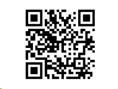

# SQL Beispiele für den Bilddruck

<!-- source: https://amic.de/hilfe/_bilderdruck.htm -->

Im Dokument wird ein Strichcode vom Typ "Qrcode" eingefügt.

Über das Kontextmenü "Formatieren..." lässt sich mittels der Register "Layout und Position" und "Größe und Abstand" die gewünschte Ziel-Position und Größe festlegen.

Im Register "Typ und Farbe" läßt sich im Abschnitt "Typ" im Feld "Text" die Anbindung einer privaten Sql-Prozedure durchführen.

Die private Sql-Procedure muss folgende Spalten zurückgeben:

| Parameter-Name | Parameter-Name |
| --- | --- |
| code | long varchar |
| codetype | long varchar |

Der Inhalt des Parameters "codetype" steuert wie der Inhalt von "code" interpretiert wird.

Siehe auch:

- [Ermittlung durch Datei](./ermittlung_durch_datei.md)
- [Ermittlung durch Archiv](./ermittlung_durch_archiv.md)
- [Ermittlung durch Sql-Statement](./ermittlung_durch_sql_statement.md)
- [Barcode/Bilderdruck-Datenquelle](./barcode_bilderdruck_datenquelle.md)
- [Barcode/Bilderdruck-Druckparameter](./barcode_bilderdruck_druckparameter.md)
- [Barcode/Bilderdruck-Druck: Weitere mögliche Vorgangs-Übergabe-Parameter](./barcode_bilderdruck_druck_weitere_moegliche_vorgangs_ueberga.md)
- [Barcode/Bilderdruck-Druck: Die Behandlung von Codetyp Null](./barcode_bilderdruck_druck_die_behandlung_von_codetyp_null.md)
