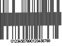
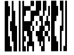
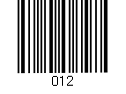
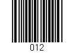
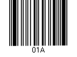
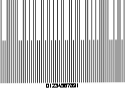

# Einfügen

<!-- source: https://amic.de/hilfe/_dokumenthilfe_einf.htm -->

Seiten:

| Funktion | Beschreibung |
| --- | --- |
| Leere Seite | Fügt eine Leere Seite ein |
| Seitenumbruch | Setzt einen Seitenumbruch an die gewünschte Zeile |

Tabellen:

| Funktion | Beschreibung |
| --- | --- |
| Tabelle | Fügt eine Tabelle mit der gewünschten Dimension ein |

Illustrationen:

  <table>
    <tbody>
      <tr>
        <td>
          
<strong>Funktion</strong>

        </td>
        <td>
          
<strong>Beschreibung</strong>

        </td>
      </tr>
      <tr>
        <td>
          
Bild

        </td>
        <td>
          
Öffnet einen Dialog zum auswählen eines Bildes

          
Setzt einen Paltzhalter, welcher später über A.eins gefüllt warden kann

        </td>
      </tr>
      <tr>
        <td>
          
Diagram

        </td>
        <td>
          
Spalte

          
Linie

          
Kreis

          
Balken

          
Fläche

          
Punkt

          
Kurs

          
Netz

        </td>
      </tr>
      <tr>
        <td>
          
Form

        </td>
        <td>
          
Linien

          
Rechtecke

          
Standardformen

          
Blockpfeile

          
Formelform

          
Flussdiagramm

          
Sterne und Banner

          
Legenden

          
Bereich erstellen

          
Bereiche ein/ausblenden

        </td>
      </tr>
      <tr>
        <td>
          
Strichcode

        </td>
        <td>
          
<a href="./qr_code_beispiele_zum_dynamischen_laden.md">Anleitung zum Dynamischen laden eines QR-Codes in A.eins</a>

          <table>
            <tbody>
              <tr>
                <th>QRCode</th>
                <th></th>
                <th>Bis zu 1270 ASCII-Werte oder 1850 alphanumerische Werte</th>
              </tr>
              <tr>
                <td>Code128</td>
                <td></td>
                <td></td>
              </tr>
              <tr>
                <td>EAN13</td>
                <td></td>
                <td>13 Ziffern</td>
              </tr>
              <tr>
                <td>UPCA</td>
                <td></td>
                <td>12 Ziffern</td>
              </tr>
              <tr>
                <td>EAN8</td>
                <td></td>
                <td>8 Ziffern</td>
              </tr>
              <tr>
                <td>Interleaved2of5</td>
                <td></td>
                <td>nur Ziffern</td>
              </tr>
              <tr>
                <td>Postnet</td>
                <td></td>
                <td>Postleitzahlen</td>
              </tr>
              <tr>
                <td>Code39</td>
                <td></td>
                <td>Alphanumerische Werte</td>
              </tr>
              <tr>
                <td>AztecCode</td>
                <td></td>
                <td>bis zu 1300 ASCII-Zeichen</td>
              </tr>
              <tr>
                <td>IntelligentMail</td>
                <td></td>
                <td>Postleitzahlen (Nachfolger von Postnet)</td>
              </tr>
              <tr>
                <td>Datamatrix</td>
                <td></td>
                <td>Bis zu 1301 ASCII-Zeichen</td>
              </tr>
              <tr>
                <td>PDF417</td>
                <td></td>
                <td>Bis zu 1500 ASCII-Zeichen</td>
              </tr>
              <tr>
                <td>MicroPDF</td>
                <td></td>
                <td>Bis zu 250 ASCII-Zeichen</td>
              </tr>
              <tr>
                <td>Codabar</td>
                <td></td>
                <td>Ziffern und die Zeichen <b>-</b>, <b>$</b>, <b>:</b>, <b>/</b>, <b>.</b> und <b>+</b></td>
              </tr>
              <tr>
                <td>Fourstate</td>
                <td></td>
                <td>8 Zeichen</td>
              </tr>
              <tr>
                <td>Code11</td>
                <td></td>
                <td>Bis zu 50 Ziffern</td>
              </tr>
              <tr>
                <td>Code93</td>
                <td></td>
                <td>Alphanumerische Werte und die Zeichen <b>-</b>, <b>$</b>, <b>:</b>, <b>/</b>, <b>.</b> und <b>+</b></td>
              </tr>
              <tr>
                <td>PLANET</td>
                <td></td>
                <td>Ziffern</td>
              </tr>
              <tr>
                <td>RoyalMail</td>
                <td></td>
                <td>Alphanumerische Werte und die Zeichen <b>(</b> und <b>)</b></td>
              </tr>
              <tr>
                <td>Maxicode</td>
                <td></td>
                <td>Zeichenfolgen (wird vom United Parcel Service verwendet)</td>
              </tr>
            </tbody>
          </table>
        </td>
      </tr>
    </tbody>
  </table>

Hyperlinks:

| Funktion | Beschreibung |
| --- | --- |
| Hyperlink | Fügt einen Hyperlink ein. |
| Textmarke | Einfügen Bearbeiten Löschen Anzeigen |

Kopf- und Fußzeilen:

| Funktion | Beschreibung |
| --- | --- |
| Kopfzeile | Lässt die Kopfzeile bearbeiten |
| Fußzeile | Lässt die Fußzeile bearbeiten |
| Seitezahl | Kann im Bearbeitungsmodus der Fußzeile hinzugefügt warden |

Text:

| Funktion | Beschreibung |
| --- | --- |
| Textrahmen | Erstellt einen Textrahmen |
| Datei | Öffnet die angegebene Datei und fügt den enthaltenen Text ein |

Symbol:

Fügt das gewünschte Symbol ein.

Siehe auch:

- [QR-Code Beispiele zum dynamischen Laden](./qr_code_beispiele_zum_dynamischen_laden.md)
