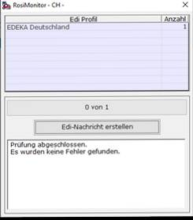

# Exportieren der EDI-Nachrichten (ausgehend)

<!-- source: https://amic.de/hilfe/exportierenderedinachrichtenau.htm -->

Wird für den Kunden, für den eine Rosieinrichtung eingerichtet ist eine Rechnung geschrieben, so erscheint der jeweilige Name der Einrichtung in der Auswahlliste (REB).

Soll die Rechnung per EDI übertragen werden, so muss der Beleg über den Menüpunkt (Elektronische Rechnung -> EDI-Datentransfermonitor) exportiert werden.

Hier werden alle markierten Rechnungen zunächst nach EDI-Partner auseinandersortiert und die im EDI-Profil hinterlegten Prüfroutinen durchlaufen. Es werden nur Rechnungen mit EDI-Partner berücksichtigt, welche noch nicht erstellt wurden. Falls die Prüfroutinen bestanden werden, erscheint nun der Button „Edi-Nachricht erstellen“.

Mit einem Klick auf den Button „Edi-Nachricht erstellen“ wird die Nachricht erstellt und falls es im Profil hinterlegt ist, auch die zugehörige Datei erzeugt und versendet.
