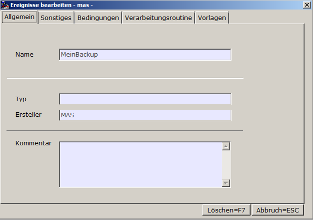

# Löschen von Events

<!-- source: https://amic.de/hilfe/lschenvonevents.htm -->

Sie erhalten eine für Eingaben und Änderungen gesperrte Ansicht des Events, das Sie zum Löschen markiert haben. Wenn Sie nun die Funktion „Löschen“ wählen, wird dieser Event aus der Eventliste gelöscht.

