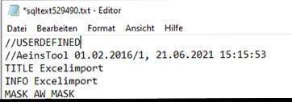

# Übernahme eines Excel-Arbeitsblattes in eine private Variante

<!-- source: https://amic.de/hilfe/bernahmeeinesexcelarbeitsblatt.htm -->

Stammdatenpflege > Stammdatenpfleger > Excel-Import

oder Direktsprung [**EXCELI**]

Mithilfe des Excel-Importes kann ein Excel-Arbeitsblatt in A.eins als private Variante integriert werden.

Schritt 1: Stammdaten anlegen

Mit dem Direktsprung **[EXCELI]** gelangt man in die Anwendung „Excel-Import“. Dort kann mit der Funktion ***Neu*** **[F8]** ein neuer Excel-Import-Stammdatensatz angelegt werden.

Hier sind folgende Felder zu pflegen:

- [Name](../excel_import_pfleger.md#Name): Name des Excelimportes. Der Name ist gleichzeitig der Name der privaten Variante.
- [Speicherort](../excel_import_pfleger.md#Speicherort): Pfad der Excel-Datei, die importiert werden soll.
- [Blatt-Name](../excel_import_pfleger.md#Blatt_Name): Name des Excel-Arbeitsblattes, das importiert werden soll.
- [Anwendung](../excel_import_pfleger.md#Anwendung): Name der Anwendung, unter der sich die private Variante befinden soll.
- [Offset Zeile](../excel_import_pfleger.md#Offset_Zeile)/ [Offset Spalte](../excel_import_pfleger.md#Offset_Spalte): Ggf. kann hier ein Wert ungleich Null eingetragen werden, wenn der Import nicht ab der ersten Zeile/Spalte erfolgen soll.

Schritt 2: Excel-Import ausführen

Um den Excel-Import auszuführen, wird in der Anwendung „Excel-Import“ **[EXCELI]** der entsprechende Stammdatensatz ausgewählt und anschließend die Funktion ***Variante aktualisieren*** **F10** aufgerufen.

Beim Excel-Import wird eine Relation basierend auf dem angegebenen Excel-Arbeitsblatt in der Datenbank angelegt und mit Daten des Excel-Blattes gefüllt. Dabei werden die Spaltenüberschriften aus Excel in die Datenbankrelation als Felder übernommen. Man beachte, dass aus technischen Gründen die Namen der Datenbankfelder auf maximal 29 Zeichen verkürzt werden müssen. Der Datentyp der Datenbankfelder hängt von dem „Datentyp“ von Excel ab (siehe [Umschlüsselungen Excel zu Aeins](./umschluesselungen_excel_zu_aeins.md)). Zusätzlich zu den in der Excel-Datei angegebenen Spalten wird die Relation um das Feld „xlsident“ erweitert. Dieses Feld fungiert als Primärschlüssel und kann zur eindeutigen Identifizierung eines Datensatzes verwendet werden. Da der Name des Primärschlüssels festgelegt ist, darf in dem Excel-Blatt keine Spalte mit dem Namen „xlsident“ existieren. Die Spalte muss vor dem Import umbenannt werden.

Die private Variante wird aktualisiert, sodass die Spalten des Excel-Blattes inklusive der Daten in der Variante angezeigt werden. Beim Excelimport erfolgt keine automatische Anlage der F2-Bereichsauswahl anhand der Excel-Spalten. Zum Filtern der Daten kann die Filterzeile der Auswahlliste 2.0 verwendet werden oder die F2-Bereichsauswahl kann nachträglich manuell angepasst werden.

**Hinweis:**

Man beachte, dass beim erneuten Ausführen der Funktion ***Variante aktualisieren*** die bestehende Relation mit ihren Daten gelöscht und neu angelegt wird. Des Weiteren wird die Variante (inkl. SQL-Text, F2-Bereichsauswahl und Optionbox) erneut angelegt. Eigene Einrichtungen können dabei verloren gehen. Dieses Verhalten lässt sich abstellen, indem im zugehörigen SQL-Text in der ersten Zeile „USERDEFINED“ als Kommentar (siehe Abbildung unten) eingetragen wird. Dann wird nur noch die Relation aktualisiert, die Variante (inkl. SQL-Text, F2-Bereichsauswahl und Optionbox) bleibt unverändert.

Siehe auch:

- [Private Variante](./private_variante.md)
- [Umschlüsselungen Excel zu Aeins](./umschluesselungen_excel_zu_aeins.md)
