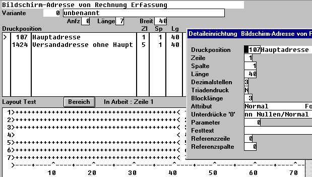
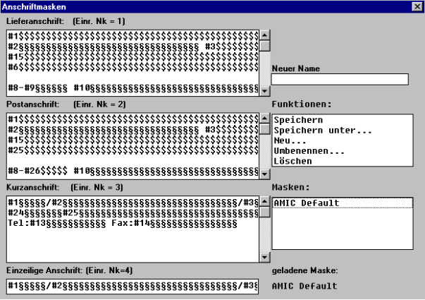

# Ablauf Einrichtung Anschriftenfeld:

<!-- source: https://amic.de/hilfe/ablaufeinrichtunganschriftenfe.htm -->

1\. In den Vorgangsunterklassen **[FRZ]** die Formular-Nr. für die 

 Bildschirmeinrichtung ermitteln. z.B. 602 Lieferschein

2\. In **[FRM]** Formulareinrichtung 602 aufrufen

3\. Formularbereich = 4 Bildschirmadresse dann ---> F6 Formulareinrichtung

 Einrichtung = Anz = 1, Lg = 10, LR = 1, Brt = 40

 unter **Detail** bei Hauptadresse eintragen: Dezimalstellen = 3

 Varianten Dezimalstellen: 

 1 = Lieferscheinadresse (kein Postfach, sondern Straße und PLZ)

 2 = Postadresse (ist ein Postfach vorhanden, so wird es 

 berücksichtigt

 3 = 3-zeilige Adresse (für Anzeige in Listen etc. wo einzeilig nicht

 reicht

 4 = 1-zeilige Adresse (für Listen)

 und Varianten Blocklänge: 3 (3-zeilige)

4\. SPA-Einstellung ändern

Option global

11 Kundenindividuelle Adressaufbereitung auf JA

5\. In Adressmaskierung **[KUAN]**

KdMaske-Variante entsprechend ändern

ins Adressfeld gehen und mit F3 die #-Felder auswählen

Platzhalter $ = fester Platzhalter (es können Lücken entstehen)

Platzhalter § = variabler Platzhalter (nächster Text wird

angehängt)

Prüfen im Kundenstamm unter Anschriftenpflege in der Adress-Maske muss AMIC default stehen
