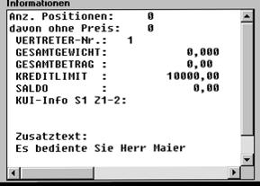

# Ablauf Einrichtung Vorgangstext in Infobox:

<!-- source: https://amic.de/hilfe/ablaufeinrichtungvorgangstexti.htm -->

Ziel ist es in der Vorgangs-Info den eingegebenen Zusatztext im Kopf / Fußbereich anzuzeigen:

Ablauf:

in [**FRM]** Formular ändern z.B. Rechnung 702

Bildschirmbereich = 3

Formulareinrichtung F6

Feld 180 = Vorgangstext Kopf/Fuß positionieren

unter Details als Parameter = interne Bereichsnummer = Vorgangstextklasse z.B.1001 eintragen

in den SPA’s Vorgangsbearbeitung allgem.

 Pos. 45 Vorgangstexte zwangsweise vor Hauptteil auf JA

Ergebnis:

