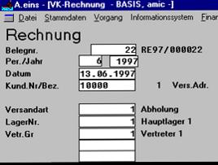
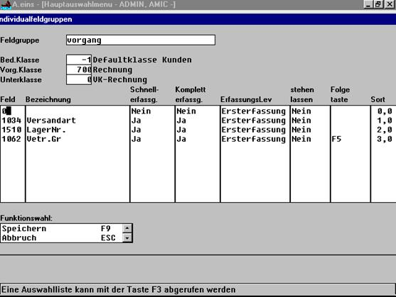

# Einrichtung Abfragefelder „UFLD“ - Block

<!-- source: https://amic.de/hilfe/einrichtungabfragefelderufldbl.htm -->

Direktsprung [UFLD]

Bedienerklasse (-1 = Default)

Vorgang (Lieferschein, Rechnung, .......)

Unterklasse = 0 VK

in Pos. Feld = F3- Taste = Auswahlliste

