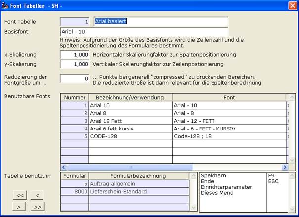

# Font Tabellen (Windowsdruck) F9

<!-- source: https://amic.de/hilfe/fonttabellenwindowsdruckf9.htm -->

Diese Funktion ist nur für Systemadministratoren frei geschaltet. Sie öffnet die Auswahlliste der Fonttabellen in der man neue Fonttabellen anlegen kann.

Mehr zu Fonttabellen steht unter [Fontverwaltung beim Formulardruck](../fontverwaltung_beim_formulardruck/index.md).

Siehe auch:

- [Font Tabellennummer](./font_tabellennummer.md)
- [Basisfont](./basisfont.md)
- [x-Skalierung](./x_skalierung.md)
- [y-Skalierung](./y_skalierung.md)
- [Reduzierung der Fontgröße um](./reduzierung_der_fontgroesse_um.md)
- [Benutzbare Fonts](./benutzbare_fonts.md)
- [Tabelle benutzt in](./tabelle_benutzt_in.md)
