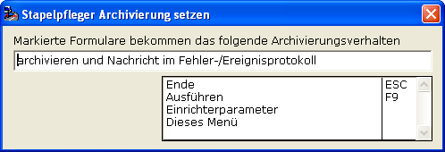

# Archivierung setzen

<!-- source: https://amic.de/hilfe/archivierungsetzen.htm -->

Hier kann man für mehrere Formulare gleichzeitig die Einstellung für die [Archivierung](../der_formular_pfleger/archivierung_aktivieren_fuer_das_formular.md) setzen.  
Die Einstellung wird beim Starten der Funktion vorbelegt mit ‚archivieren und Nachricht im Fehler-/Ereignisprotokoll’. Dies kann man aber durch die F3-Auswahl wie gewünscht anpassen. Durch die Funktion Ausführen F9 wird diese Einstellung dann für alle markierten Formulare übernommen.

