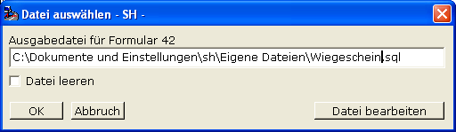

# Export Formular

<!-- source: https://amic.de/hilfe/exportformular.htm -->

Diese Funktion ist nur für Systemadministratoren frei geschaltet.

Sie ermöglicht den Export eines markierten Formulars in eine SQL-Datei z.B. für den Transfer in eine andere Datenbank. Man gibt den Pfad- und Dateinamen an und wählt dann ok. Verwendet man eine schon vorhandene Datei mit altem Inhalt für den Export, kann man diese durch die Option ‚Datei leeren’ vorher leeren. Der Knopf ‚Datei bearbeiten’ öffnet die SQL-Datei im Editor.

