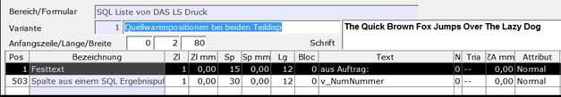
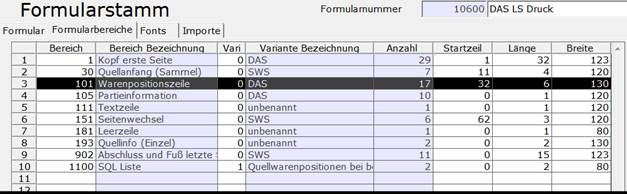
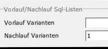

# Einrichtung des Druckbereichs 1100

<!-- source: https://amic.de/hilfe/einrichtungdesdruckbereichs110.htm -->

Für die Beschreibung einer SQL-Liste wurde der neue Druckbereich 1100 = ‚Sql-Zeilen‘ geschaffen. Man richtet hier (durch Verwendung der Variante) unterschiedliche Listen ein. In allen anderen Druckbereichen und im Formularstamm gibt man unter ‚Vorlauf Varianten‘ bzw. ‚Nachlauf Varianten‘ eine oder mehrere Variantennummern des Druckbereichs 1100 ein (durch Komma getrennt). Man kann also im Vorlauf oder Nachlauf mehrere verschiedene Listen hintereinander drucken.

In einer Variante des Druckbereichs 1100 wird das SQL-Statement durch den Namen eines privaten SQL-Textes im Eingabefeld ‚SQLK für Vor/Nachlauf‘ angegeben (Knopf >Bereich&lt;). Die Parametrisierung des SQL-Statements kann mit der ‚:‘-Logik erfolgen. Dabei kann auf alle ‚ID_...‘ Werte des Druckbereiches zugegriffen werden, der diese Liste druckt. Die ID-Namen können im Formulareinrichter aus der F3-Box zur Auswahl der Druckposition abgelesen werden.

Im Druckbereich einer Variante von 1100 greift man auf den Wert einer Ergebnisspalte aus dem SQL-Statement mit der Druckposition 503 (Spalte aus einem Ergebnispuffer) zu. Der Name der Spalte wird in das Textfeld eingetragen.

Beispiel: Lieferscheindruck (aus Auftrag) bei Teildisposition

SQLK erstellen:

// Priv. SQL Text sqlk_Teildispo_Druck ---

with Auftragsmengen

 ( wabewid, wabewerfassid,menge, liefermenge, restmenge, v_numnummer, v_datum )

 as

 ( select wb.wabewid,wabewerfassid,

 if ( wabeworimenge != 0) then wabeworimenge else wabewmenge endif as menge,

 if ( wabeworimenge != 0 ) then Wabeworimenge - wabewmenge else

 if ( vs.v_statusumwand >2 ) then

 wabewmenge else wabewmengedisp + vp.VP_WareDispKorMe endif

 endif as Liefermenge,

 menge -liefermenge restmenge,

 vs.v_numnummer,

 vs.v_datum

 from warenbewegung wb join

 v_posiware vp on vp.wabewid = wb.wabewid join

 vorgangstamm vs on vs.v_id = vp.v_id join

 vorgreservierung vr on vr.v_id = vs.v_id

 where wabewvorgklasse = 400)

 select am.wabewid,

 wabewmenge as diesemenge,

 am.menge,

 am.liefermenge,

 am.restmenge,

 am.v_numnummer,

 am.v_datum

 from warenbewegung wb join

 Auftragsmengen am on wb.wabewerfassid = am.wabewerfassid

 where wb.wabewid = :ID_WABEWID

Das SQLK wird im Formularwesen (FRM) im Feld „SQLK für Vor/Nachlauf“ hinterlegt („Knopf“ Bereich)

Die Positionen werden wie folgt angelegt:

Im Bereich 101 (Warenpositionen) muss die Variante 1 von dem Bereich 1100 im Feld Nachlauf Varianten hinterlegt werden (F6 Einrichtung und „Knopf Bereich“):

