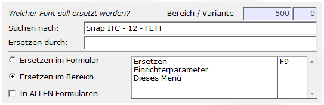

# Ersetze Font F6

<!-- source: https://amic.de/hilfe/ersetzefontf6.htm -->

Mit dieser Funktion lassen sich Schriftarten durch andere ersetzen. Hierbei kann unterschieden werden, ob man die Ersetzung nur im Bereich oder im Formular oder aber auch in ALLEN Formularen durchführen will.

Für die Felder „Suchen nach:“ und „Ersetzen durch:“ stehen jeweils F3 Funktionen zur Verfügung. Für „Suchen nach:“ öffnet die Funktion eine Itembox mit allen im Formular vorhandenen Bereichen und Varianten für die bereits Schriftarten festgelegt sind.

Für „Ersetzen durch:“ öffnet die Funktion die Auswahl der installierten Schriftarten.

Wird das Feld „Suche nach:“ frei gelassen, also leer, so werden alle leeren Zeilen durch die gewählte Schriftart ersetzt.

Um nun zu entscheiden, wo die Ersetzung durchgeführt werden soll, werden im unteren Bereich der Maske verschiedene Möglichkeiten angeboten.

„Ersetzen im Formular“ gibt an das die Schriftart im Formular stattfinden soll. D.h zum Beispiel leere Zeilen aller Bereiche und Varianten des gesamten Formulars ersetzen.

„Ersetzen im Bereich“ gibt an, dass die Ersetzung nur innerhalb des angegebenen Bereichs stattfinden soll

„In ALLEN Formularen“ kann zusätzlich angewählt werden. Somit werden die Änderungen für alle Formulare übernommen. Auch hier ist die Differenzierung des gewählten Bereichs möglich. D.h., dass die Änderung in allen Formularen stattfindet, in denen der gewählte Bereich vorhanden ist.

Mit der Funktion „Ersetzen“ werden die gewünschten Änderungen übernommen.
