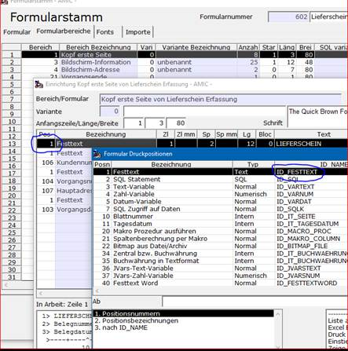
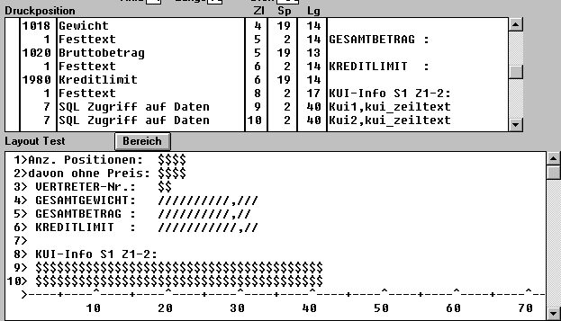

# Zusatzfelder in Vorgang selbst einrichten mit [SLQM oder SQLK]

<!-- source: https://amic.de/hilfe/zusatzfelderinvorgangselbstein.htm -->

Es kann trotz aller Einrichtung nicht jeder Wunsch nach Druckbarkeit von spezifischen Informationen in Vorgängen seitens A.eins erfüllt sein. Um die Möglichkeit zu schaffen, zusätzliche Informationen im Belegdruck darzustellen, kann mittels privater SQL-Texte ein zusätzlicher Dateninhalt zum Druck im Bereich Warenwirtschaft herangezogen werden. Die Parametrisierung der SQL-Anweisungen erfolgt über die Einbindung von Identifikatoren versehen mit dem Erkennungssymbol‘:‘. Ursprünglich wurden nur die folgenden 4 Identifkatoren vorgesehen:

V_ID (im Bereich Quellvorgang ist dies die V_ID der Quelle)

KUNDID

ARTIKELID

WABEWID

In einer späteren Version hat man einen erweiterten Mechanismus zur Parametrisierung der SQL Anweisungen geschaffen. Nach dem Erkennungssymbol ‚:‘ können jetzt alle legalen Druckpositionen mit ihren ‚ID_...‘ Namen spezifiziert werden. Eine Liste aller Druckpositionen liefert die Anwendung ‚Druckpositionen‘ (Direktsprung: FRMP). Eine Übersicht, in welchem Druckbereich welche Druckposition gültig ist, bekommt man beim Formulareinrichter per F3-Box:

 

Beispielsweise könnte man in einem SQLK auf einem Warenpositionsbereich mit folgender Konstruktion die Artikelnummer an eine Datenbankfunktion Test_ArtikelNummer übergeben:

 Select Test_Artikelnummer(‚:ID_ARTIKELNUMMER‘) as Ergebnis from dummy

Einige ID_‘s erwarten einen numerischen Parameter, wenn es für diese ID mehrere Werte gibt (z.B. mehrere Steuersätze). Man kann diese Parameter durch ein unmittelbar anschließendes Komma und einer Zahl übergeben:

 Select :ID_STEUERSCHLUESSEL,3 as Schluessel from …

Ähnliches gilt für zeichenhafte Parameter, wie etwa den Spaltennamen eines Feldes aus der Ergänzungsrelation zur Warenbewegung. Bei zeichenhaften Parametern wird als Trennzeichen das Symbol ‚@‘ erwartet.

 Select :ID_WARENBEWEGUNG_ADDON@Herkunft as Herkunft from …

Um private SQL-Texte anzulegen, verwendet man den Direktsprung [SQLM] und dann die Variante Private SQL-Texte oder den Direktsprung [SQLK].

Beispiel: 1. Zeile der 1. Seite der KUI

 select Kui_zeiltext from Kundeninfozeile

 where Kui_seinummer=1

 and Kui_zeilnummer=1

 and kundid=:KUNDID

Eintrag im Formulareinrichter Bereich 3 = Bildschirm-Information

Siehe auch:

- [Beispiele für SQL-Texte](./beispiele_fuer_sql_texte.md)
