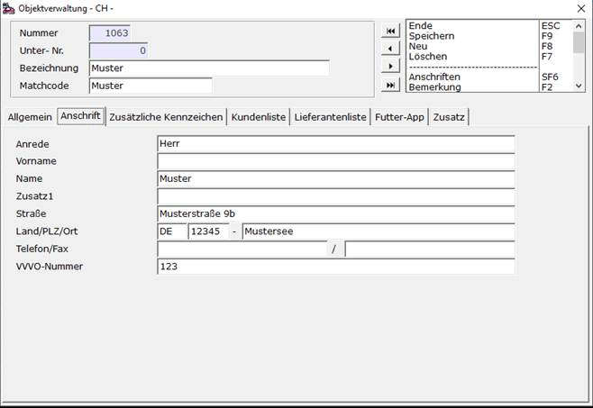
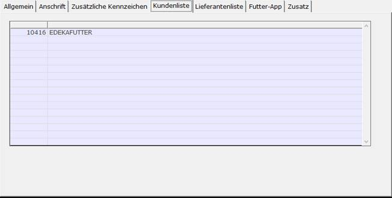

# Baustelle/Silo

<!-- source: https://amic.de/hilfe/baustellesilo.htm -->

In der Baustelle <strong>[BAU]</strong> muss das für die App relevante Silo ausgewählt und mit F5 die Bearbeitungsmaske geöffnet werden. Unter dem Tab-Reiter „Anschrift“ muss nun erneut die VVVO-Nummer gepflegt werden.

Unter dem Tab-Reiter „Kundenliste“ müssen die Kunden eingetragen werden.

