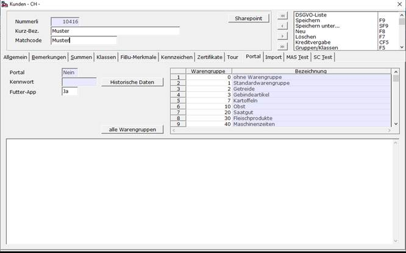
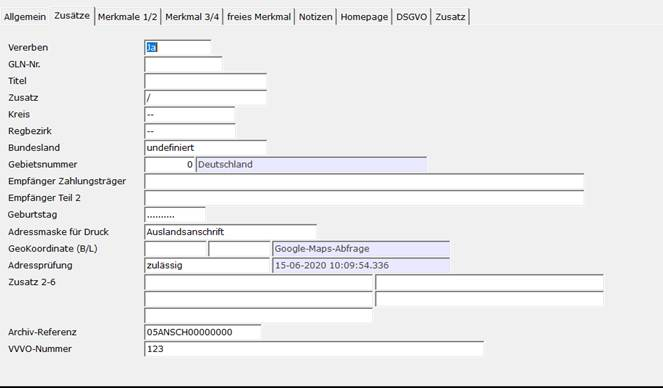

# Kunde

<!-- source: https://amic.de/hilfe/kunde.htm -->

Zunächst muss der Kunde gepflegt werden. Hierfür unter **[KU]** den gewünschten Kunden auswählen und mit F5 bearbeiten. Auf dem Tab-Reiter „Pfleger“ befindet sich nun die Einstellung für die FutterApp.

Zunächst den Schalter auf „Ja“ setzen und anschließend in der rechten Tabelle die Warengruppen aussuchen, welche der Kunde auf seiner App angezeigt bekommen soll. Der Button „alle Warengruppen“ füllt die Tabelle mit allen in A.eins eingetragenen Warengruppen.

Im zweiten Schritt muss nun noch die Anschrift gepflegt werden. Hierfür die Funktion aus der Optionbox auswählen und die der Anschriftenmaske auf den Tab-Reiter „Zusätze“ wechseln.

Dort muss die VVVO-Nummer eingetragen werden.

