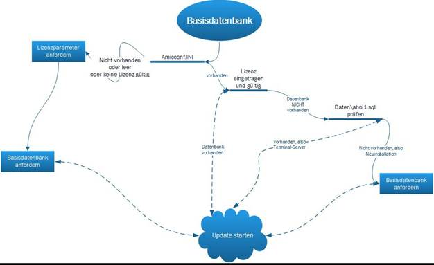

# Mandantenupdate / -einrichtung

<!-- source: https://amic.de/hilfe/mandantenupdateeinrichtung.htm -->

Das Setup Programm ist in der Lage, mehrere Mandanten gleichzeitig mit einem Setup zu versehen, in der AeinsSetup.ini Datei braucht nur vermerkt zu werden, welcher Mandant auch mit in den Automatikprozess mit integriert werden soll.

Basisdatenbank:

