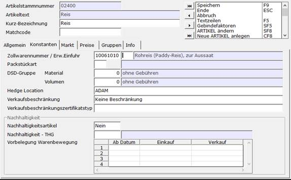
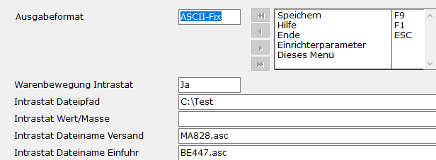
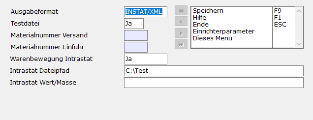
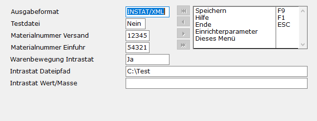

# Schritt 1 Voraussetzungen

<!-- source: https://amic.de/hilfe/Intrastatsfs1.htm -->

Schritt 1.1: Lizenz

Für das Modul Intrastat wird die [Intrastat-Lizenz](../../../firmenstamm/steuerparameter/lizenzen/intrastat_lizenz_spa1094.md) benötigt.

Schritt 1.2: Stammdaten

Folgende Stammdaten müssen hinterlegt sein, damit eine Intrastat-Meldung erstellt werden kann:

- [Kundenstamm](../../../kunden_und_lieferanten/uebersicht_kunden_und_lieferanten.md) **[KU]**  
Im Register <em>„Allgemein“</em> muss das Land des Kunden hinterlegt sein  
Die UST.-Ident muss gepflegt sein  
Und die Steuergruppe darf nicht der Steuergruppe entsprechen, welche im SPA 643 eingetragen ist

- [Lagerstamm](../../../firmenstamm/uebersicht_lager_und_lagerplatz/lagerstamm_lgs.md) **[LGS]**  
Im Register <em>„Allgemein“</em> muss das Land des Lagerstandortes hinterlegt sein

- [Mandantenstamm](../../../firmenstamm/firmenkonstanten/mandantenstamm.md#MND_FIBU) **[MND]**  
Hier muss das Bundesland und die Steuernummer hinterlegt sein

Schritt 1.3: Artikel mit Intrastat-Nummern

Da jedes meldende Unternehmen eine eigene Artikelnummerierung aufweist, hat das Statistische Bundesamt eine für die Intrastat maßgebliche Nummerierung der Artikel bzw. Artikelbereiche vorgenommen. Das „Warenverzeichnis für die Außenhandelsstatistik“ enthält die Warennummern, die im Artikelstamm zu hinterlegen sind.

Für diese Einrichtung geht man mit dem Direktsprung **[ARS]** in den [Artikelstamm](../../../artikelstamm_und_artikel/artikel/index.md). Danach den Artikel auswählen und bearbeiten **(F5)**. Im Pfleger dann unter dem Reiter „Konstanten“ die Zollwarennummer des Artikels eintragen. Die Zollwarennummer gleicht der Intrastat-Nummer.

Nachzulesen sind die Nummern unter:

[https://www.zolltarifnummern.de](https://www.zolltarifnummern.de)

Schritt 1.4: Intrastat einrichten:

Um die Intrastat-Meldung einzurichten navigiert man mit dem Direktsprung **[INTRA]** in die Intrastat-Auswahllisten. Hier ruft man mit ***(F10)*** die Funktion „Intrastat einrichten“ auf.

Wichtig: seit Februar 2020 wird ein neues Format (XML) für die Intrastat-Meldung verlangt. Das Alte Dateiformat (ASCII) wird nur noch bis zum 30.06.2021 akzeptiert. Alle neu angemeldeten Benutzer nach dem 31.01.2020 sind verpflichtet das XML-Format zu nutzen.  
Quellen:

- [https://www-idev.destatis.de/idev/doc/intra/hilfe6_1.html](https://www-idev.destatis.de/idev/doc/intra/hilfe6_1.html) (ASCII)
- [https://www-idev.destatis.de/idev/doc/intra/hilfe6_2.html](https://www-idev.destatis.de/idev/doc/intra/hilfe6_2.html) (XML)

### ASC-Format:

Der ASCII Export wird nur noch bis zum 30.06.2021 unterstützt. Die Empfehlung ist daher das Ausgabeformat auf XML umzustellen!

### XML Format:

Registrierung (Testdaten):

- Unter [https://www-idev.destatis.de/idev/OnlineMeldung](https://www-idev.destatis.de/idev/OnlineMeldung) bei dem Statistischen Bundesamt registrieren
- Für die Registrierung muss das Feld „Testdatei“ auf „Ja“ gesetzt sein
- Eine Anzahl von 10 Praxisbezogenen Datensätzen ist erforderlich (zu Schritt 2)
- Nach der Registrierung bei dem Statistischen Bundesamt, den Datenexport der Testdatei an diese versenden

Einrichtung (Echtdaten):

Vor der Versendung der ersten Echtdaten muss das Feld „Testdatei“ auf „Nein“ gesetzt werden und anschließend in die Felder „Materialnummer Versand/Einfuhr“ die vom Statistischen Bundesamt ausgestellt Materialnummern eingetragen werden.

[Weiter zu Schritt 2](./schritt_2_erweiterung_und_anpassung_in_a_eins.md)
