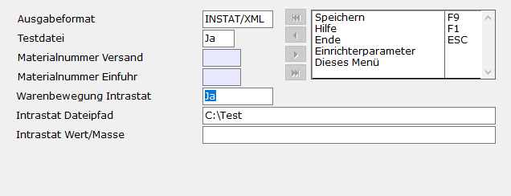
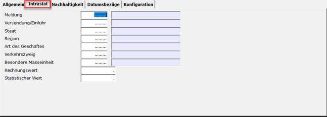
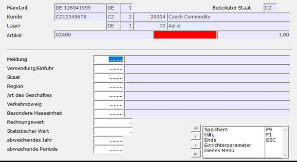
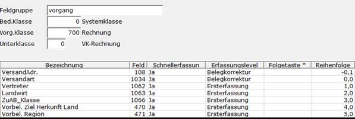
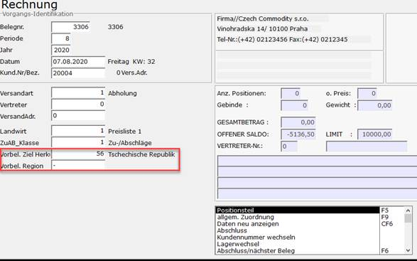
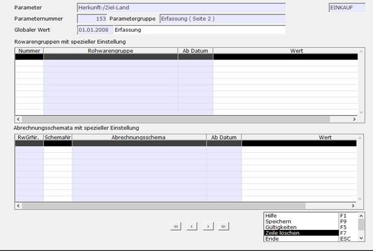

# Schritt 2 Erweiterung und Anpassung in A.eins

<!-- source: https://amic.de/hilfe/Intrastatsfs2.htm -->

Schritt 2.1: Prioritäten

A.eins bietet 3 kombinierbare Wege an, wie die Daten für die Intrastat Meldung ermittelt werden können :

Die 3 Möglichkeiten werden in folgender Priorität ausgewertet :

Priorität 1: Intrastat Zusatzdaten und spezieller Ergänzungsregister Intrastat in den Warenposition

Priorität 2: Explizite Eingaben des EU-Staates und der Region unter UFLD und in der Warenbewegung

Priorität 3: Automatische Bestimmung aus Vorgangsdaten

Schritt 2.2: Intrastat Ergänzung bei Warenposition (Priorität 1)

Um in den Warenpositionen das Zusatzregister „Intrastat“ angezeigt zu bekommen, muss man zuerst mit dem Direktsprung **[INTRA]** in die Intrastat-Auswahllisten. Dort dann mit **(F10)** die Funktion ***„Intrastat einrichten“*** aufrufen. In dieser Maske muss dann das Feld „Warenbewegung Intrastat“ auf „Ja“ gesetzt werden. Als letztes mit **(F9)** speichern.

Nach dieser Einstellung wird in den Warenpositionen das Register „Intrastat“ sichtbar.

Schritt 2.3: Intrastat-Zusatzdaten (Priorität 1)

Um die Intrastat relevanten Daten auch nach dem Fibu Übertrag noch korrigieren zu können, muss man Direktsprung **[INTRA]** in die Intrastat-Positionen (Variante 1). Hier den gewünschten Datensatz auswählen und diesen mit **(F5)** bearbeiten. Anschließend speichert man den Datensatz mit **(F9)** ab.

Schritt 2.4: UFLD Felder in der Warenbewegung (Priorität 2)

Um in der Rechnungserfassung die Felder „Ziel Herkunft Land“ und „Region“ hinzuzufügen navigiert man mit dem Direktsprung **[UFLD]** in die Benutzerfelder. Hier muss bei der gewünschte Datensatz für die Rechnung bearbeitet werden **(F5)**. In der Maske Individualfeldgruppen fügt man nun die Nummern 471 und 470 hinzu und speichert den Datensatz dann mit (F9) ab.

In einer Rechnungserfassung werden nun die Felder angezeigt.

Schritt 2.5: Parameter im Rohware Modul(Priorität 3)

Mit dem Direktsprung **[RWPA]** kommt man in die Parametersteuerung des Rohware Moduls. Danach mit **(F2)** nach *„Herkunft“* suchen. Hier alle Datensätze mit **(F5)** bearbeiten. Hier dann den Globalen Wert mit **(F3)** auf *„Erfassung“* setzten und mit **(F9)** speichern. Danach ist im Rohwaremodul die Erfassung des Herkunftlandes/Region freigeschaltet.

[Weiter zu Schritt 3](./schritt_3_meldung_erstellen_beispiel_versand.md)
