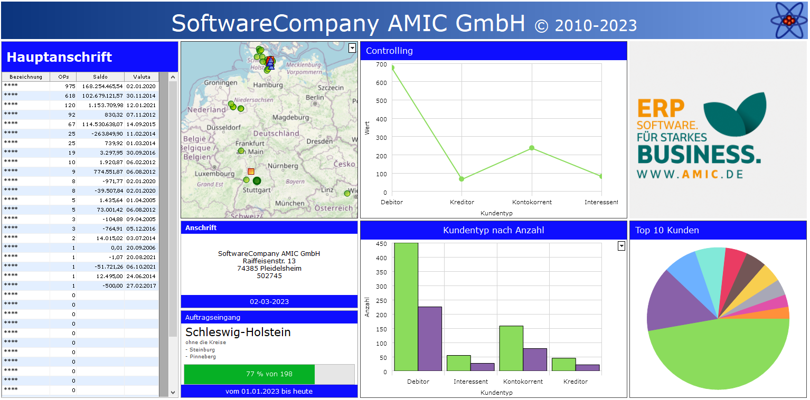

# Das Dashboard

<!-- source: https://amic.de/hilfe/dasdashboard.htm -->

Administration > Menü > Dashboard

oder

Direktsprung **[DASH]**

Ab dem März Release ist es mit der 64-Bit Version möglich auf einem extra Menü-Register ein Dashboard einzurichten. Ein Dashboard besteht aus verschiedenen Kacheln mit unterschiedlichen Darstellungsarten.

Siehe auch:

- [Board einrichten](./board_einrichten.md)
- [Kachel einrichten](./kachel_einrichten.md)
- [Prozeduren oder Views für Kacheln einrichten](./prozeduren_oder_views_fuer_kacheln_einrichten/index.md)
