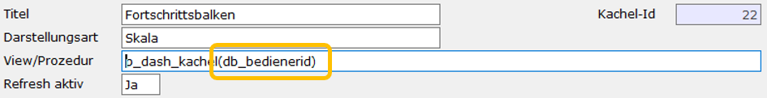

# Kachel einrichten

<!-- source: https://amic.de/hilfe/kacheleinrichten.htm -->

Administration > Menü > Dashboard > Variante Kachel

oder

Direktsprung **[DASH]** \> Variante Kachel

Auf einem bereits eingerichteten Dashboard erreicht man die Bearbeitungsmaske der Kachel auch direkt über das Kontextmenü (rechte Maustaste) des Dashboards, wenn man mit der Maus über der Kachel steht.

  <table>
    <tbody>
      <tr>
        <td>
          
Feldbezeichnung

        </td>
        <td>
          
Beschreibung

        </td>
      </tr>
      <tr>
        <td>
          
Titel

        </td>
        <td>
          
Der Titel dient als Beschreibung der Kachel. Dieser muss eindeutig sein. Zusätzlich wird eine Kachel intern über eine eindeutige Ident identifiziert. Der Titel kann jederzeit geändert werden.

        </td>
      </tr>
      <tr>
        <td>
          
Darstellungsart

        </td>
        <td>
          
Art der Darstellung. Es existieren folgende Möglichkeiten:  

          <ul>
            <li><a href="./prozeduren_oder_views_fuer_kacheln_einrichten/darstellungsart_text.md">Text</a></li>
            <li><a href="./prozeduren_oder_views_fuer_kacheln_einrichten/darstellungsart_tabelle.md">Tabelle</a></li>
            <li><a href="./prozeduren_oder_views_fuer_kacheln_einrichten/darstellungsart_fortschrittsbalken.md">Fortschrittsbalken</a></li>
            <li><a href="./prozeduren_oder_views_fuer_kacheln_einrichten/darstellungsart_skala.md">Skala</a></li>
            <li><a href="./prozeduren_oder_views_fuer_kacheln_einrichten/darstellungsart_saeulen_flaechen_und_liniendiagramm.md">Säulendiagramm</a></li>
            <li><a href="./prozeduren_oder_views_fuer_kacheln_einrichten/darstellungsart_saeulen_flaechen_und_liniendiagramm.md">Flächendiagramm</a></li>
            <li><a href="./prozeduren_oder_views_fuer_kacheln_einrichten/darstellungsart_saeulen_flaechen_und_liniendiagramm.md">Liniendiagramm</a></li>
            <li><a href="./prozeduren_oder_views_fuer_kacheln_einrichten/darstellungsart_tortendiagramm.md">Tortendiagramm</a></li>
            <li><a href="./prozeduren_oder_views_fuer_kacheln_einrichten/darstellungsart_bild.md">Bild</a></li>
            <li><a href="./prozeduren_oder_views_fuer_kacheln_einrichten/darstellungsart_deutschland_europakarte.md">Deutschlandkarte</a></li>
            <li><a href="./prozeduren_oder_views_fuer_kacheln_einrichten/darstellungsart_deutschland_europakarte.md">Europakarte</a></li>
            <li><a href="./prozeduren_oder_views_fuer_kacheln_einrichten/darstellungsart_kombinationsdiagramm.md">Kombinationsdiagramm</a></li>
            <li><a href="./prozeduren_oder_views_fuer_kacheln_einrichten/darstellungsart_balkendiagramm.md">Balkendiagramm</a></li>
            <li><a href="./prozeduren_oder_views_fuer_kacheln_einrichten/darstellungsart_kalender.md">Kalender</a></li>
          </ul>
        </td>
      </tr>
      <tr>
        <td>
          
View/Prozedur

        </td>
        <td>
          
Über die private Prozedur oder View werden alle Daten geliefert, die zur Erstellung einer Kachel benötigt werden. Dabei unterscheiden sich die benötigten Daten je nach Darstellungsart. Eine genaue Beschreibung der verschiedenen Darstellungsarten findet man unter „<a href="./prozeduren_oder_views_fuer_kacheln_einrichten/index.md">Prozeduren oder Views für Kacheln einrichten</a>“.

          
Grundsätzlich werden Views bzw. Prozeduren ohne Parameter aufgerufen. Man der Prozedur jedoch eigene Parameter mitgeben. Dies können Konstanten, db_variablen oder LDB-Variablen (mit vorangestelltem Doppelpunkt) sein. Beispiel

          

            <pre><code>Create procedure p_dash_kachel(in integer bedienerid)
.</code></pre>
          

          
        </td>
      </tr>
      <tr>
        <td>
          
Refresh aktiv

        </td>
        <td>
          
Hiermit wird gekennzeichnet, ob diese Kachel auf eine „Refresh-Prozedur“ reagieren soll (Refresh aktiv = Ja) oder nicht.

        </td>
      </tr>
      <tr>
        <td colspan="2">
          
<b>Bei Klick ausführen:</b> Die folgenden Felder sind <b>nur alternativ</b> zu belegen. Sind mehrere Felder belegt, so wird nur die erste belegte Funktion ausgeführt. Steht der Mauszeiger auf einer Kachel mit einer Funktion, so wird das Handsymbol als Mauszeiger verwendet.

        </td>
      </tr>
      <tr>
        <td>
          
Funktion

        </td>
        <td>
          
Hier kann eine private oder offizielle Anwendungsfunktion (Direktsprung [ANWF]) eingetragen werden, die als Direktsprung oder aus dem Menü heraus aufgerufen werden kann. In den Funktionen kann auf die Felder <b>ID1</b> bis <b>ID4</b> über die JVars <b>JVAR_KACHEL_ID1</b> bis <b>JVAR_KACHEL_ID4</b> mit dem Owner 7659 zugegriffen werden:

        </td>
      </tr>
      <tr>
        <td>
          
Pfleger

        </td>
        <td>
          
Aufruf eines Stammdatenpflegers, der im Pflegerstamm definiert sein muss. Für diesen Funktionsaufruf müssen die Werte, die für ID1, ID2, ID3 bzw. ID4 erwartet werden, von der View geliefert werden.

          
Wenn man hier z.B. den Kundenstamm als Pfleger aufrufen möchte, so müsste in der View u.a. stehen:

          

            <code>Select kundid as ID1, …..</code>
          

          
Ein Beispiel findet man auch unter <a href="./prozeduren_oder_views_fuer_kacheln_einrichten/darstellungsart_deutschland_europakarte.md">Geographische Karte</a>

        </td>
      </tr>
      <tr>
        <td>
          
Refresh-Prozedur

        </td>
        <td>
          
Hier kann eine Prozedur angegeben werden, mit der einzelne Kacheln des Dashboards neu angezeigt werden können. Diese Prozedur soll die idents der Kacheln zurückgeben, die neu Aufgebaut werden sollen. Dabei ist die Idee dahinter die, dass durch den Klick ein Wert in eine Datenbankvariable gesetzt wird, der dann von den anderen Kacheln ausgewertet wird. Damit kann man dann zu dem ausgewählten Datensatz noch genauere Informationen anzeigen.&nbsp;

          
Die Datenbankprozedur hat genau sechs Parameter, die Id_board des Dashboards, die Id_kachel der auslösenden Kachel und die Identwerte, die ID1 bis ID4 entsprechen, wie sie auch vom Pfleger (siehe oben) verwendet werden. Der Typ der Ident-Parameter (interger, string, …) hängt vom Typ des ID-Feldes ab.

          
Sie muss die Kachel_id der Kacheln liefern, die neu aufgebaut werden sollen.

          
Beispielprozedur:

          

            <pre><code>CREATE PROCEDURE p_dash_Refresh
  (in in_id_board integer,
   in in_id_kachel integer,
   in in_ident1 integer default null,
   in in_ident2 integer default null,
   in in_ident3 integer default null,
   in in_ident4 integer default null )
BEGIN
 create or replace Variable pdb_adressid integer =0;
 set pdb_adressid = in_ident1;
 select id_kachel from Dash_Board_Kachel_Link
  where Id_Board = in_id_board and id_kachel!= in_id_kachel;
 EXCEPTION
  when others then
    call amic_exception( ERRORMSG() || CHAR(10) || CHAR(13) || TRACEBACK(), SQLCODE , SQLSTATE , 'p_dash_Refresh' , -1 );
END</code></pre>
          

          
In den privaten Prozeduren der Kacheln würde man dann auf pdb_adressid zugreifen:  Beispielprozedur einer einfachen Textkachel (ohne jegliche Formatierung):

          

            <pre><code>CREATE PROCEDURE p_dash_kundeninfo()
BEGIN
  if varexists('pdb_adresssid') = 0 then
   create or replace variable pdb_adresssid integer = -1;
  endif;
  select
   adressname || '&lt;br&gt;' || adressStrasse || '&lt;br&gt;' || adressplz1 ||' ' || adressort  as text
   from anschriftstamm where adressid = pdb_adresssid and adresstyp in (11,12,15)
END</code></pre>
          

        </td>
      </tr>
    </tbody>
  </table>

