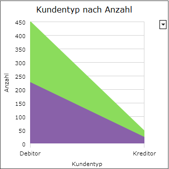
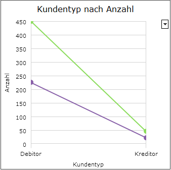
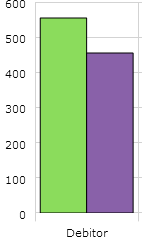
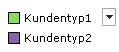
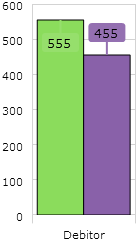

# Darstellungsart Säulen-, Flächen und Liniendiagramm

<!-- source: https://amic.de/hilfe/kacheldiagramm.htm -->

Administration > Menü > Dashboard > Variante Kachel

oder

Direktsprung **[DASH]** \> Variante Kachel

Neben den hier beschriebenen Feldern stehen zusätzlich alle Felder aus dem [Basisdesign](./basisdesign.md) zur Verfügung.

  <table>
    <tbody>
      <tr>
        <td></td>
        <td></td>
      </tr>
      <tr>
        <td>  </td>
        <td>
          
<strong>Säulen-, Flächen und Liniendiagramm</strong>

          
In einem Säulen-, Flächen und Liniendiagramm können jeweils bis zu <u>zehn</u> Serien (Datenreihen) angezeigt werden. Dabei wird jede Serie in einer eigenen Farbe dargestellt. Jede Serie besteht aus ein oder mehreren Datenpunkten. Die Datenpunkte werden mit <b>X</b> (Werte der horizontalen Achse) und <b>Y</b> (Werte der vertikalen Achse) angegeben.

          
<u>Achsen</u><u></u>

          
Die Diagramme bestehen aus einer horizontalen X- und einer vertikalen Y-Achse. Auf der Y-Achse werden ausschließlich numerische Werte angezeigt, während auf der X-Achse sowohl Text als auch numerische Werte angeben werden können.

          
Bei der X-Achse ist zu beachten, dass die Werte sequenziell - so wie sie von der Prozedur geliefert werden - und <u>nicht</u> sortiert nach ihren Werten, angeordnet werden. Ausnahme: Für Datumsangaben auf der X-Achse kann in der View/Prozedur das Feld <b>XAxisType</b> mit dem Wert „date“ angegeben werden. Dann werden die Werte auf der X-Achse automatisch nach dem Datum sortiert.

          
Mit den Feldern <b>XAxisTitle</b> und <b>YAxisTitle </b>kann ein Titel für die Achsen vergeben werden. Außerdem kann für die Y-Achse optional ein Minimal- und Maximalwert (<b>YAxisMinValue </b>und <b>YAxisMaxValue</b>) festgelegt werden.

          
Über die Felder <b>XAxisInterval</b> und <b>YAxisInterval</b> kann das Intervall für die Beschriftung der X- bzw. Y-Achse vorgegeben werden. Gleichzeitig wird hiermit auch der Abstand zwischen den Gitternetzlinien festgelegt. Wird ein Wert von „0“ oder kein Wert für das Intervall angegeben, so wird das Intervall automatisch bestimmt.

          
Handelt es sich bei X-Achse um eine Datumsachse (XAxisType „date“), so wird das Intervall in Form von Anzahl in Tagen festgelegt.

          
<u>Darstellung mehrerer Datenreihen</u><u></u>

          
Um mehrere Serien in einem Diagramm darzustellen, ist in dem Feld „Serie“ für jede Datenreihe jeweils ein Wert (0 bis 9) anzugeben. Für jede Serie kann außerdem mithilfe des Feldes <b>SeriesTitle</b> ein Titel vergeben werden. Der Titel wird u.a. in der Legende und ggf. im Tooltip angezeigt. Sind mehrere Serien in einem Diagramm vorhanden, können über dem Knopf mit dem „Pfeil“ Serien ein- und ausgeblendet werden:

          
          
<u>Balken und Säulen überlagern</u><u></u>

          
Mit dem Feld <b>OverlapValue</b> kann für Säulen- und Balkendiagramme der Abstand zwischen den Säulen bzw. Balken verringert werden. Der Wert kann zwischen 0 und 1 reichen, wobei der Standardwert 0 ist. Für andere Diagrammarten hat das Feld keine Auswirkung.

          <table>
            <tbody>
              <tr>
                <th>OverlapValue: 0</th>
                <th>OverlapValue: 1</th>
              </tr>
              <tr>
                <td></td>
                <td></td>
              </tr>
            </tbody>
          </table>
          
Beim Setzen des OverlapValues auf 1 ist zu beachten, dass Serien mit einer kleineren Nummer von Serien mit einer größeren Nummer verdeckt werden können.

          
<u>Legende</u><u></u>

          
Mithilfe des Feldes <b>LegendVisible</b> kann eingestellt werden, ob die Legende standardmäßig ein- oder ausgeblendet ist. Unabhängig von dieser Option kann die Legende über die Funktion <strong><em>Legende ein-/ausblenden</em></strong> (rechte Maustaste auf der Kachel) aktiviert bzw. deaktiviert werden. Des Weiteren ist die Position (<b>LegendPosition</b>) und die Ausrichtung (<b>LegendOrientation</b>) der Legende über die View/Prozedur einstellbar. Mögliche Werte sind:

          
LegendPosition

          <ul>
            <li>Right</li>
            <li>Left</li>
            <li>Bottom</li>
            <li>Top LegendOrientation</li>
            <li>Vertical</li>
            <li>Horizontal</li>
          </ul>
          
          
<u>Tooltipp</u><u></u>

          
Mit dem Feld <b>SeriesTooltip</b> kann der Tooltip über HTML formatiert werden. Der Tooltip erscheint, wenn der Mauszeiger über einen Datenpunkt des Diagramms bewegt wird. Existiert das Feld <b>SeriesTooltip</b> nicht in der View/Prozedur, so wird der Tooltipp nicht angezeigt.

          
          
<u>Datenbeschriftung</u><u></u>

          
Mit dem Feld <b>ValueLabelVisible</b> kann eine Datenbeschriftung im Diagramm aktiviert bzw. deaktiviert werden. Der Standardwert ist 0 (deaktiviert).

          
          
Beispielview:

          

            <pre><code>CREATE VIEW p_dash_saeule AS
  With daten as (
    select
    0 as serie,
   'Serie 0' as seriesTitle,
   count(*) as Y,
   AMIC_FORMLST_GETBEZEICH('kundtyp', kundtyp) as X
   from kundenstamm
   group by kundtyp
   union all
   select
   1 as serie,
   'Serie 1' as seriesTitle,
   count(*) / 2 as Y,
   AMIC_FORMLST_GETBEZEICH('kundtyp', kundtyp) as X
   from kundenstamm
   group by kundtyp
  )
 select
   'Kundentyp nach Anzahl' as header,         -- Wird kein header angegeben, steht der Platz dem Mittelteil zur Verfügung.
   'center'    as headeralign,        -- Horizontale Positionierung. Mögliche Werte sind &gt;left&lt;, &gt;center&lt; und &gt;right&lt;.
   'solid' as borderstyle,          -- Mögliche Wert sind: &gt;none&lt;(standard), &gt;solid&lt;, &gt;raised&lt;, &gt;inset&lt;
   '68/68/68' as bordercolor,       -- Bei Borderstyle = Solid muss man noch die bordercolor festlegen
 -- In dem Diagramm können bis zu 10 Datenreihen (Serie 0 bis 9) angezeigt werden. Jede Datenreihe (Serie) wird
 -- in einer eigenen Farbe dargestellt. Zu jeder Serie und zu jeder Achse kann ein Titel vergeben werden.
    'Kundentyp' as XAxisTitle,
    'Anzahl' as YAxisTitle,
 -- Die Angaben eines Minimal- bzw. Maximalwertes für die Achsen ist optional.
 -- Die Minimal- und Maximalwerte der X-Achse werden nur bei Datumsangaben ausgewertet.
 --   0 as YAxisMinValue,
 --   500 as YAxisMaxValue,
     '&lt;u&gt;' || seriesTitle || '&lt;/u&gt;&lt;br&gt;' || XAxisTitle || ':: ' || X || '&lt;/br&gt;&lt;br&gt;' || YAxisTitle || ':: ' || Y || '&lt;/br&gt;' as SeriesTooltip,
    'bottom' as LegendPosition,
    'horizontal' as LegendOrientation,
    0 as LegendVisible,
    *
    from daten</code></pre>
          

        </td>
      </tr>
    </tbody>
  </table>

