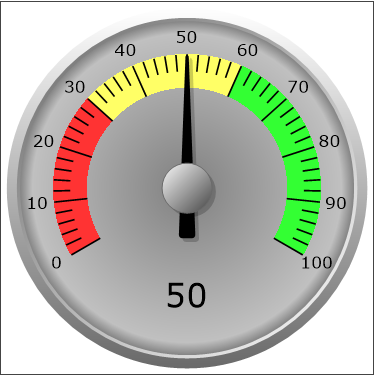

# Darstellungsart Tachometer

<!-- source: https://amic.de/hilfe/kacheltachometer.htm -->

Administration > Menü > Dashboard > Variante Kachel

oder

Direktsprung **[DASH]** \> Variante Kachel

Neben den hier beschriebenen Feldern stehen zusätzlich alle Felder aus dem [Basisdesign](./basisdesign.md) zur Verfügung.

  <table>
    <tbody>
      <tr>
        <td></td>
        <td></td>
      </tr>
      <tr>
        <td></td>
        <td>
          
<strong>Tachometer</strong>

          
Für das Tachometer können in der View/Prozedur folgende Felder eingerichtet werden:

          <table>
            <tbody>
              <tr>
                <th><b>Minimum</b> <b></b>&nbsp;</th>
                <th>Der minimale Wert des Tachometers. Der Standardwert ist 0.</th>
              </tr>
              <tr>
                <td><b>Maximum</b> <b></b>&nbsp;</td>
                <td>Der maximale Wert des Tachometers. Der Standardwert ist 100.</td>
              </tr>
              <tr>
                <td><b>Value</b> <b></b>&nbsp;</td>
                <td>Mit dem Feld <b>Value</b> wird der Wert angegeben, der mit dem Zeiger dargestellt werden soll. Der Wert wird außerdem im unteren Bereich des Tachometers (unterhalb des Zeigers) angezeigt. Er muss zwischen Minimum und Maximum liegen.</td>
              </tr>
              <tr>
                <td><b>Majorinterval</b> <b></b>&nbsp;</td>
                <td>Das Intervall für die Hauptmarkierungen (mit den Zahlen). Standartmäßig wird dieses Intervall mit (<b>Maximum</b>-<b>Minimum</b>) / 10 berechnet.</td>
              </tr>
              <tr>
                <td><b>Minorinterval</b> <b></b>&nbsp;</td>
                <td>Das Intervall für die kleineren Markierungen. Standartmäßig wird dieses Intervall mit <b>Majorinterval</b> / 5 berechnet.</td>
              </tr>
            </tbody>
          </table>
          
<u>Farbangaben</u><u></u>

          
Das Tachometer kann in bis zu drei Farbbereiche unterteilt werden.

          <table>
            <tbody>
              <tr>
                <th><b>LowerFillingColor</b></th>
                <th>Mit <b>LowerFillingColor</b> wird die Farbe am linken Rand angegeben. In der Beispielabbildung ist es die Farbe #FF3333. Wird keine Farbe angegeben, dann wird die Hintergrundfarbe verwendet.</th>
              </tr>
              <tr>
                <td><b>LowerFillingTo</b></td>
                <td>Mit diesem Feld wird angegeben, bis zu welchem Wert die <b>LowerFillingColor</b> angezeigt werden soll. Der Wert muss zwischen dem Minimum und dem Maximum liegen.</td>
              </tr>
              <tr>
                <td><b>FillingColor</b></td>
                <td>Hier wird die Farbe angegeben, die zwischen <b>LowerFillingTo</b> und <b>UpperFillingFrom</b> dargestellt werden soll. In der Beispielabbildung wird die Farbe #ffff66 verwendet.</td>
              </tr>
              <tr>
                <td><b>UpperFillingColor</b></td>
                <td>Mit <b>UpperFillingColor</b> wird die Farbe am rechten Rand angegeben. In der Beispielabbildung ist es die Farbe #33FF33. Wird keine Farbe angegeben, dann wird die Hintergrundfarbe verwendet.</td>
              </tr>
              <tr>
                <td><b>UpperFillingFrom</b></td>
                <td>Mit diesem Feld wird angegeben, ab welchem Wert die <b>UpperFillingColor</b> angezeigt werden soll. Der Wert muss zwischen dem Minimum und dem Maximum liegen.</td>
              </tr>
            </tbody>
          </table>
          
<u>Hinweis:</u><u></u>

          
<i>Sollen in dem Tachometer nur zwei verschiedene Farben dargestellt werden, so kann man das Feld <b>LowerFillingTo</b> auf 0 setzen. Dann werden nur die <b>FillingColor </b>und die <b>UpperFillingColor</b> angezeigt.</i>

          
Beispielview:

          

            <pre><code>CREATE VIEW p_dash_tacho AS
 select
   0   as Minimum,                -- Wenn nicht angegeben, dann 0
   100 as Maximum,                -- Wenn nicht angegeben, dann 100
   50  as Value,                  -- muss zwischen minimum und maximum liegen.
   -- 20 majorinterval,           -- Optional. Wenn nicht gesetzt dann (maximun-minimum)/10
   -- 5 minorinterval,            -- Optional. Wenn nicht gesetzt dann majorinterval/5
   '#ff3333' LowerFillingColor ,  -- Linker Farbwert
   '#ffff66' FillingColor ,       -- mittlerer Farbwert
   '#33ff33' UpperFillingColor ,  -- rechter Farbwert
   30 LowerFillingTo,             -- Grenze zwischen linkem und mittlerem Farbwert
   60 UpperFillingFrom            -- Grenze zwischen mittlerem und rechtem Farbwert</code></pre>
          

        </td>
      </tr>
    </tbody>
  </table>

