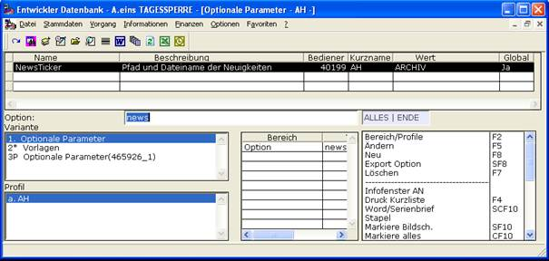
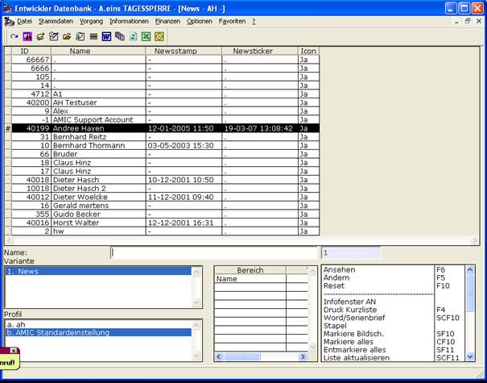
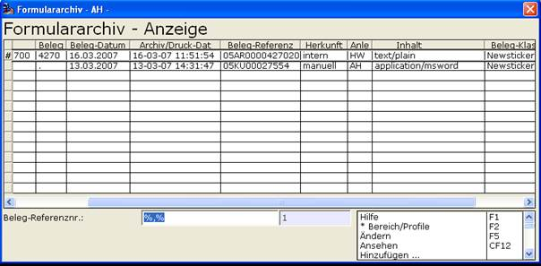
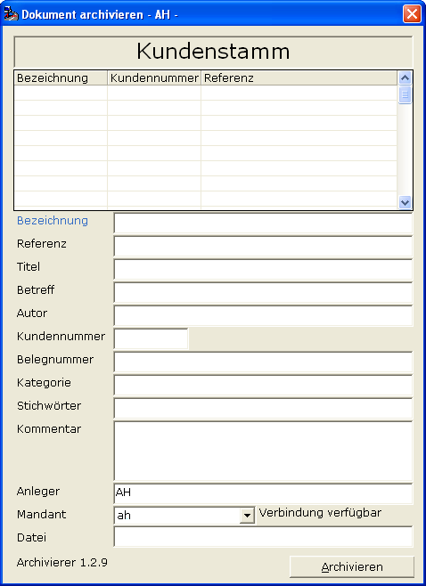

# Newsticker

<!-- source: https://amic.de/hilfe/newsticker.htm -->

Informationen einmalig bereitstellen.

Die Idee ist, eine Information zu hinterlegen, und dem Anwender zu signalisieren, dass es eine Information gibt.

Dabei soll das System nach Ansicht der Informationen durch den Anwender diese Benachrichtung zurücknehmen.

Das Newsticker-System in A.eins bietet eben dies.

Ausgelöst wird das Verhalten durch die A.eins-Option Newsticker.

Als Werte für die Option stehen folgende 3 Möglichkeiten zur Verfügung:

Keine Angabe. Dann wird standardmäßig die Dateiangabe **archivhinweis.html** verwendet!

Die Angabe „ARCHIV“. Dann werden die Informationen aus dem Formulararchiv verwendet. Bitte beachten Sie, dass dies nur möglich ist, wenn das Formulararchiv in der Datenbank ist.

Eine Dateianschrift. Also der Pfad und Name auf eine zu behandelnde Datei.

Administriert wird über die Anwendung Newsticker mit Direktsprung NEWS  
    

Die Funktion „Reset“ erlaubt die unmittelbare „Wiedervorlage“ der Dokumente.

Die Funktion Ändern ( F5 ) öffnet im Dateifalle die anzuzeigende Datei und erlaubt somit eine mögliche Erneuerung der Informationen.

Ist das Formulararchiv involviert, dann wird die FAA-Ansicht AMIC-NEWSTICKER ausgeführt und diese hält dann beispielhaft folgende Möglichkeiten bereit:

Eine einfache Wiedervorlage-Möglichkeit hat man nun durch Ändern ( F5 ) oder eine weitere Bereitstellung über „Hinzufügen…“

und anschließendem Ändern der Belegklasse auf 9002.
