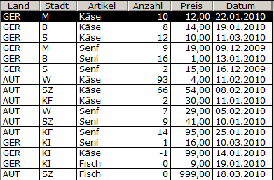
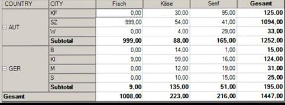

# Allgemeines zu OLAP

<!-- source: https://amic.de/hilfe/allgemeineszuolap.htm -->

Viele Daten lassen sich als Listen nicht einfach erfassen. Hier sei ein Beispiel genannt, welche Daten in einer OLAP-Auswertung besser als in einer Datenliste dargestellt werden können:

Beispiel Verkaufsauswertung

Die Liste enthält Daten zu Land, Stadt, Anzahl der verkauften Artikel, Preis pro Artikel und ein Verkaufsdatum.

 

Diese lassen sich als OLAP-Pivot-Tabelle darstellen, indem die Daten gruppiert nach Land und Stadt aufgetragen auf die Vertikale und Artikel auf der Horizontalen mit den Datenangaben in Datenfeldern angezeigt werden.

