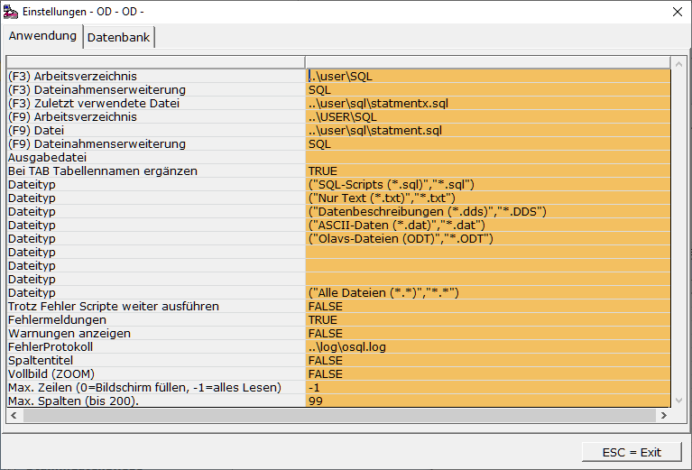
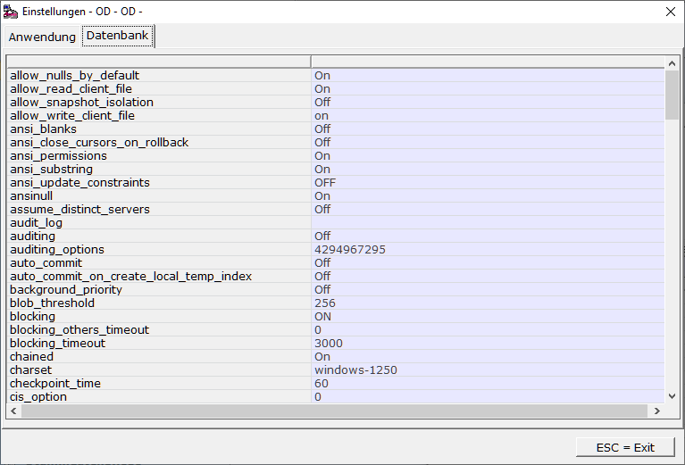

# Optionen (F10)

<!-- source: https://amic.de/hilfe/optionenf10.htm -->

Wenn man unter OSQL die Funktion ***Optionen*** **F10** auswählt, so öffnet sich folgender Dialog mit zwei Reitern:

#### Anwendung:

 

  <table>
    <tbody>
      <tr>
        <td></td>
        <td></td>
      </tr>
      <tr>
        <td>
          
(F3) Arbeitsverzeichnis

          
(F3) Dateinamenserweiterung

          
(F3) Zuletzt verwendete Datei

        </td>
        <td>
          
Diese Einstellungen beziehen sich auf die Dialogmaske, die man über die Funktion <strong><em>SQL ausführen</em></strong> <strong>F3 </strong>erreicht.

        </td>
      </tr>
      <tr>
        <td>
          
(F9) Arbeitsverzeichnis

          
(F9) Datei

          
(F9) Dateinamenserweiterung

        </td>
        <td>
          
Diese Einstellungen beziehen sich auf die Dialogmaske, die man über die Funktionen <strong><em>Sichern Eingabe </em>SCF9, <em>Ausführen Statement</em> CF9 </strong>und<strong> <em>Editieren Statement</em> SF9 </strong>erreicht.

        </td>
      </tr>
      <tr>
        <td>
          
Ausgabedatei

        </td>
        <td>
          
Dieser Dateiname wird dort als Vorbelegung verwendet, wo OSQL Daten&nbsp; in eine Datei schreiben soll.

        </td>
      </tr>
      <tr>
        <td>
          
Bei TAB Tabellennamen ergänzen

        </td>
        <td>
          
Es wird, wenn man die TAB-Taste drückt, der nächste Tabellenname – bei Shift-TAB der vorherige – ergänzt.

          
Beispiel:

          

            <code>Select * from Waehr&lt;TAB&gt;</code>
          

          
Ergibt

          

            <code>Select * from WaehrIsoList</code>
          

          
Beim erneuten drücken von Tab

          

            <code>Select * from WaehrUmrechInfo</code>
          

        </td>
      </tr>
      <tr>
        <td>
          
Dateityp ….

        </td>
        <td>
          
Die Dateitypen, die in den Dateiauswahldialogen angeboten werden sollen. Der Syntax dazu ist wie folgt:

          
("Text", "Suchkriterium")

          
Wobei der Text die Beschreibung enthält, wie z.B. „SQL-Skript (*.SQL)“. Der gesamte Test müsste folgendermaßen lauten:

          
(SQL-Skript (*.SQL)“, „*.sql“)

        </td>
      </tr>
      <tr>
        <td>
          
Trotz Fehler Skripte weiter ausführen

        </td>
        <td>
          
Im Normalfall werden SQL-Skripte trotz Fehler weiter ausgeführt. Trägt man hier FALSE ein, so wird die Ausführung des Skripts sofort beendet.

        </td>
      </tr>
      <tr>
        <td>
          
Fehlermeldungen

        </td>
        <td>
          
Man kann OSQL dazu bringen, dass keine Fehlermeldungen angezeigt werden. Dazu trägt man hier den Wert FALSE ein.

        </td>
      </tr>
      <tr>
        <td>
          
Warnungen anzeigen

        </td>
        <td>
          
Sybase unterscheidet zwischen Fehlern und Warnungen. Warnungen der Datenbank werden von A.eins im Normalfall nicht ausgegeben. Unter OSQL werden Warnungen jedoch angezeigt (TRUE). Stellt man hier FALSE ein, so verhält sich OSQL wie der Rest des Programms.

        </td>
      </tr>
      <tr>
        <td>
          
Spaltentitel

        </td>
        <td>
          
TRUE =&gt; Es wird immer der gesamte Spaltentitel angezeigt und die Spalte ggf. verbreitert.

          
FALSE =&gt; Die Spalte wird in der Standardbreite des Feldes angezeigt. Will man hier den kompletten Spaltentitel sehen, kann man auf den Titel klicken und die Spalte wird dann ggf. verbreitert.

        </td>
      </tr>
      <tr>
        <td>
          
Vollbild (ZOOM)

        </td>
        <td>
          
Hiermit wird voreingestellt, ob die Maske den gesamten Bildschirm ausfüllt (TRUE) oder nur einen Teil des Bildschirms(FALSE)

        </td>
      </tr>
      <tr>
        <td>
          
Max. Zeilen (0=Bildschirm füllen, -1=alles Lesen)

        </td>
        <td>
          
Hier existieren zwei Modi:

          
0&nbsp;&nbsp;&nbsp; Es wird immer nur der Bildschirm gefüllt. Wenn man mehr Daten haben will, so muss man mit den Blättern-Tasten „Bild rauf“ und „Bild runter“ weiterblättern. Man erkennt, ob man alle Daten gelesen hat, an der Statuszeile. Dort steht dann „Gelesene Datensätze 99999“.

          
-1&nbsp;&nbsp; Es werden alle Daten geladen. Während der Ladephase kann bereits das nächste Stamement erfasst werden. Sobald eine Funktion aufgerufen wird, bricht das laden ab.

        </td>
      </tr>
      <tr>
        <td>
          
Max. Spalten (bis 200).

        </td>
        <td>
          
Anzahl der Spalten die angezeigt werden. Wenn nicht bereits anders eingestellt, wird hier 49 vorgeschlagen.

        </td>
      </tr>
    </tbody>
  </table>

#### Datenbank:

Hier werden die Optionen der Datenbank angezeigt. Ein Ändern der Werte ist nicht möglich. Lesen sie dazu die Sybase Dokumentation zu „Database Options“

