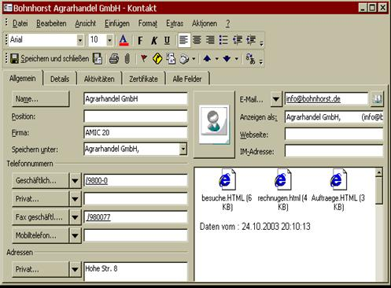
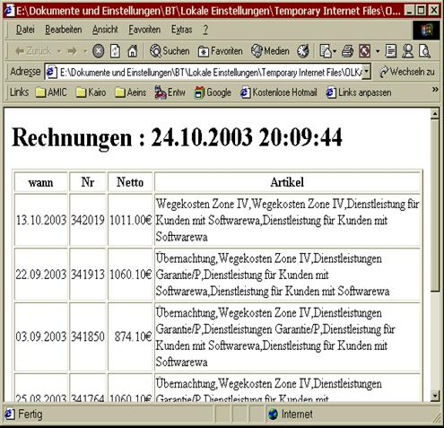
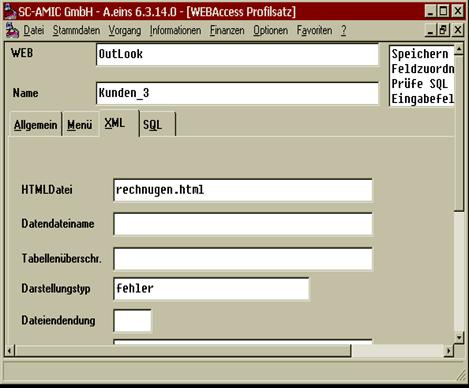
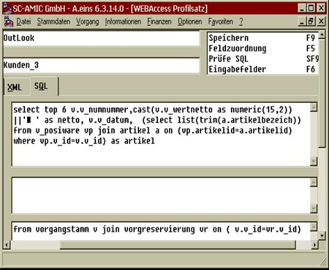
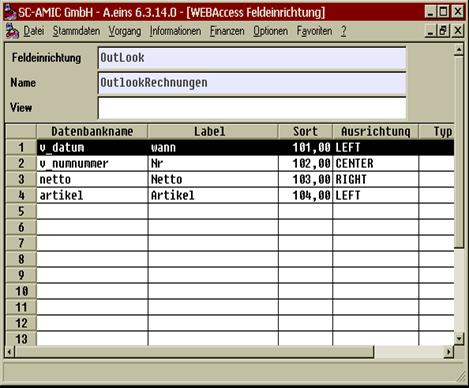

# Darstellung mit HTML Anlagen

<!-- source: https://amic.de/hilfe/darstellungmithtmlanlagen.htm -->

Sollen nun die im Notiz Bereich eingetragenen Informationen in schöner Tabellenform dargestellt werden, so kann dieses per HTML Anlage erfolgen. Das Ergebnis sieht dann wie folgt aus:

Und eine Rechnungsanzeige dann :

Einzurichten ist dieses wie folgt :

Der Tabreiter 3 einer Unterdatendarstellung oder eines Darstellung von mehreren Datensätzen in einem Kontakt muss dann mit einem HTML Dateiname versehen werden.

Des weiteren muss in dem Tabreiter 4 der Select Bereich als Einzelnamenbereich angelegt werden, also ohne Notiz Alias.

Im zugehörigen Feldzuordnungsbereich ist nun eine genaue Angabe der Felder vorzunehmen, die in die HTML Anlage eingespeist werden sollen.

Hierbei ist nun der Datenbankname der Orginal Datenbankname, Label ist die Überschrift in der HTML Tabelle, die Sortierung ist größer 100 zu wählen, um von den anderen Einrichtungen unterschieden zu werden und die Ausrichtung ist entsprechend der Ausrichtung in der HTML Tabelle zu wählen, also LEFT, RIGHT oder CENTER..
