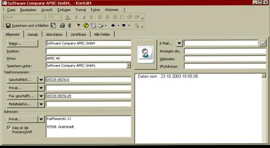
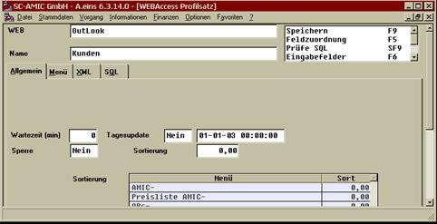
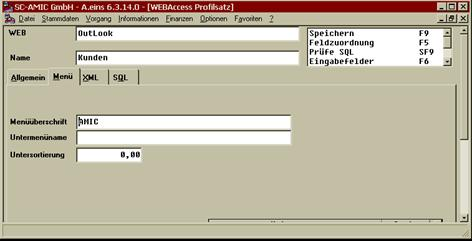
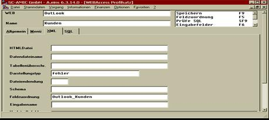
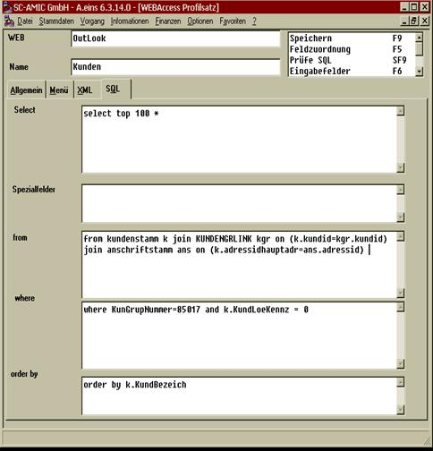

# Einrichtung Einzeleintrag ohne Ergänzung

<!-- source: https://amic.de/hilfe/einrichtungeinzeleintragohneer.htm -->

Folgendes Outlookbeispiel soll implementiert werden :

Der Datensatz Kunden setzt sich aus folgenden Tabreitern zusammen :

Der erste Tabreiter ist neben dem sinnvollen Tagesupdate Datum noch mit dem Kennzeichen 0 für Einzeleintrag pro Datensatz und zwar im Feld Wartezeit in min zu versehen, sowie einer Sperre NEIN.

Der Tabreiter 2 ist in der Menüüberschrift mit dem Firmennamen aufzufüllen, nach diesem Firmennamen kann später eine Gruppierung im Outlook erreicht werden. Der Firmenname kann ggf. noch um ein Kennzeichen erweitert werden, um eine bessere Gruppierung zu erreichen. Dieser zusätzliche Gruppierungsname wird in der Abteilung Feldposition festgelegt.

Der Tabreiter 3 ist im Feld Feldzuordnung mit einem Wert zu belegen, dazu muss zunächst mit dem F5 Knopf eine Feldzuordnung erstellt werden, die dann an dieser Stelle per F3 abgerufen werden kann.

Auf dem nächsten Tabreiter ist nun das komplette SQL Statement zu spezifizieren, nach dem die einzelnen Datensätze ausgewählt werden sollen :

Das SQL Statement muss in 5 Teile zu zerlegt werden, es ist notwendig das die kompletten Teilbefehle eingegeben werden, hier darf ein from oder ein where NICHT weggelassen werden.

Das obigen Beispiel setzt sich zusammen aus dem select Befehl :

Select top 100 \*

Der besagt, dass die ersten 100 Kundensätze gewählt werden sollen, einem leeren Spezialfeldbereich, einem From Bereich der Form

from kundenstamm k join KUNDENGRLINK kgr on (k.kundid=kgr.kundid) join anschriftstamm ans on (k.adressidhauptadr=ans.adressid)

wobei der Kundenstamm mit dem Adressstamm und der Kundengruppentabelle verbunden wird, sowie einem where Bereich

where KunGrupNummer=85017 and k.KundLoeKennz = 0

der eine bestimmte Kundengruppe auswählt und einer Sortierung, die in diesem speziellen Fall keine Bedeutung hat, außer dass beim Datentransfer die Datensätze sortiert angezeigt werden

order by k.KundBezeich
