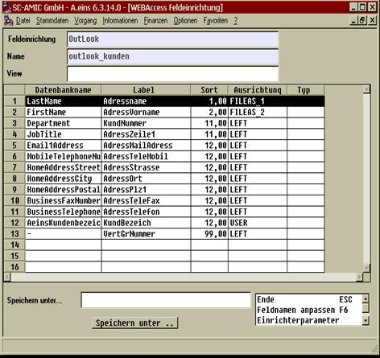
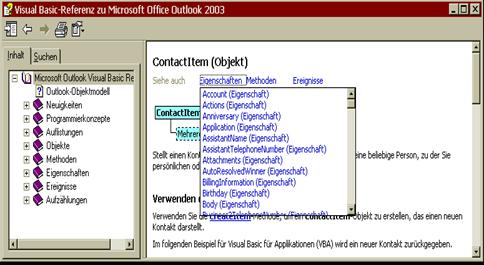
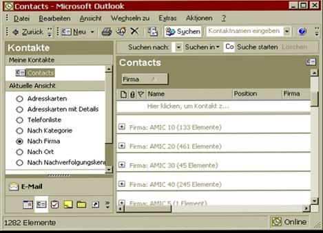
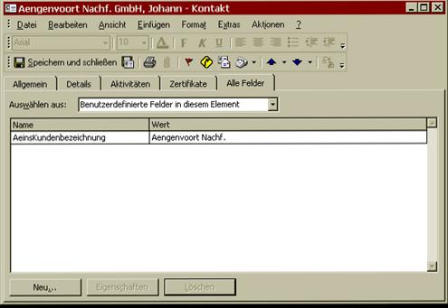

# Feldzuordnung

<!-- source: https://amic.de/hilfe/feldzuordnung.htm -->

Zusätzlich zu dem SQL Befehl muss nun angegeben werden, welches Outlook Feld mit welchem A.eins feld „verbunden“ werden soll, hierzu ist in der F5 Maske Feldzuordnung folgendes einzugeben :

Ist noch nichts angegeben, so muss im Neu Fall das Feld Name mit einem Sinnvollen Namen belegt werden, der dann in der oben erwähnten Maske UNBEDINGT eingetragen werden muss, sonst werden keine Felder zugeordnet.

Das Feld View kann freigelassen werden.

Jetzt sind nacheinander die Felder Datenbankname, Label und Sortierung einzugeben.

**Datenbankname**

In diesem Feld ist der Orginalname des Outlook Kontakt Ordners anzugeben. Dieser Orginalname ist per Outlook Objektmodell leicht abfragbar, dazu ist im Outlook der bereich Makro anzuwählen, und hier die Visual Basic Editor Variante. Innerhalb dieses Bereiches kann dann das Outlook Objekt Modell geöffnet werden, und in diesem Bereich ist der Contact Bereich anwählbar, der eine Auflistung aller Orginalnamen der Outlook Kontaktordners enthält.

Die zugehörige Hilfedatei liefert auch eine genaue Liste aller Feldnamen mit den entsprechenden Erklärungen.

**Label**

Das Feld Label ist nun in diesem Falle mit dem A.eins Datenbanknamen zu versehen, mit dem der entsprechende Kontaktwert aufgefüllt werden soll.

**Sortierung**

Wichtig ist jetzt das Sortierungsfeld, eine Sortierung bis 10 gibt an, dass dieses Feld als eindeutiger Schlüssel zur Festlegung der Datensatzeindeutigkeit innerhalb von Outlook herangezogen werden soll, sind mehrer Felder angegeben, so werden diese später im Outlook per Komma Leertaste getrennt.

Ein Wert zwischen 11 und 90 gibt an, das diese Felder eins zu eins in Outlook Kontaktfelder übernommen werden sollen.

Der Wert 99 ist reserviert für das Firmengruppierungskennzeichen, im obigen Beispiel werden die Kunden noch nach der Vertretergruppe untergruppiert.

Wie hier am Beispiel AMIC 10, AMIC 20, AMIC 30, ... zu sehen ist.

Das Feld Ausrichtung wird in dieser Variante zur Kennzeichnung von Benutzerspezifischen Feldern eingesetzt, wird in diesem Feld ein USER eingetragen, so ist dieses Feld ein Benutzereigenes Feld im Outlook, das automatisch angelegt wird.

